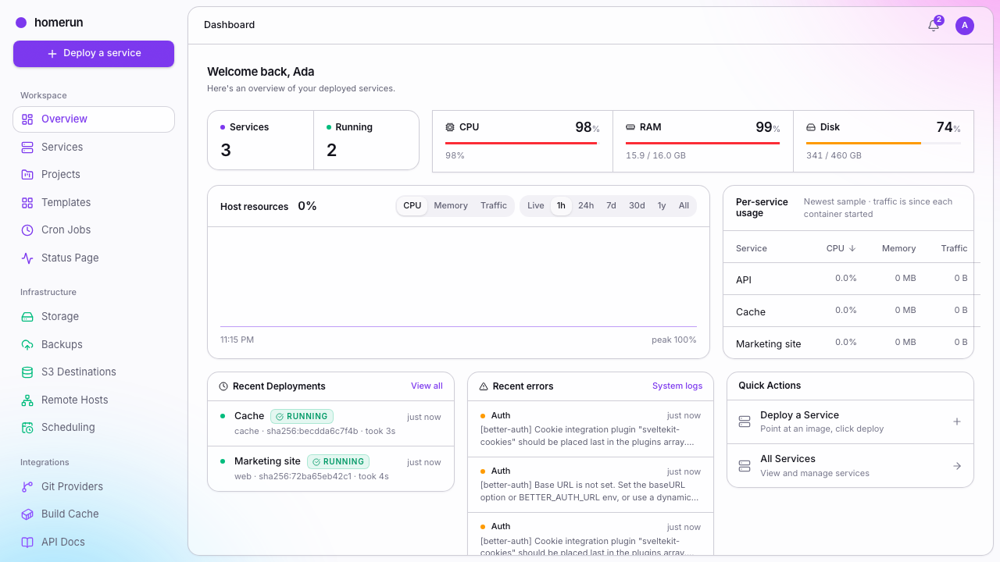

# Homerun

**A self-hosted, single-user PaaS for deploying Docker containers with a
click-config form**: a minimal Dokploy / Cloud Run alternative for your own
hardware.

Point at an image (or a git repo), fill in env vars / port / resources, hit
deploy: Traefik routes it to `<slug>.yourdomain.com` with TLS, automatically.
Single host, local Docker socket, no Kubernetes, no multi-node orchestration to
babysit.

> **Status:** Actively developed, running on real hardware, but still finding
> its shape: see [`docs/faq-and-limitations.md`](docs/faq-and-limitations.md)
> for what's solid and what isn't yet.

<!-- Regenerate with `bun run screenshots`; do not edit by hand. -->

**[See the full showcase →](docs/showcase.md)** — every screen, light and dark,
generated from a real instance.

## Why Homerun

Dokploy, Coolify, and friends are great, but there are stuff I can't get around:

- Coolify has many bugs and a lot of tech debt
- Dokploy has started paywalling features that homelab enthusiasts could use at
  the benefit of enterprise.

## Features

- **Services**: deploy from a Docker image _or_ build from a git repo's
  Dockerfile (any git-clone-able HTTPS URL, including a self-hosted Gitea); env
  vars, CPU/memory limits, restart policy, private registry auth
- **Live deploy progress**: pull/build/create/start streamed to the UI in real
  time, resumes correctly if you reload mid-deploy
- **Deployment history**: every attempt recorded with status, image digest, and
  its full log
- **Search, filters, pagination & bulk actions**: every list page (services,
  stacks, templates, storage, and more) gets server-side search/filters, a
  list/card view toggle, and paging once you have more than a screenful;
  multi-select Start/Stop/Restart/Delete on the services list, with a typed
  confirmation before anything destructive runs
- **Stacks**: group services under one Docker network so they reach each other
  by slug (`http://api:8080`), independent of the shared Traefik network
- **Templates**: a built-in catalog of ~58 common self-hosted apps (Jellyfin,
  the *arr stack, Pi-hole, Vaultwarden, Grafana, Uptime Kuma, PostgreSQL, Redis,
  n8n and more) with real app logos, one-click **Quick Deploy**, companion
  containers that come along with the primary (WordPress pulls MySQL), plus save
  any service's config as your own reusable template
- **Storage volumes**: define bind-mount paths or Docker-managed volumes once,
  mount into one or more services
- **Compose import**: paste a `docker-compose.yaml` and turn its services,
  volumes and dependency order into Homerun rows, with an up-front preview of
  everything that doesn't map across
- **Smart service links**: point a new service at an existing Postgres, MySQL,
  Redis, Mongo or RabbitMQ and get the connection URL (or JDBC URL, or one
  variable per value) filled in for you, with names you can rename
- **Live log streaming & a web terminal**: tail stdout/stderr or open an
  interactive shell into a running container, all from the browser
- **Custom domains & SSL**: a second hostname per service, plus bring-your-own
  cert/key for domains outside Traefik's automatic ACME coverage
- **Build servers**: build a git-based service's image on another Docker daemon
  (`tcp://`/`ssh://`, or the lightweight
  [Homerun Agent](packages/agent/README.md)) instead of this host
- **Swarm mode**: opt-in Docker Swarm deploys for real replica scaling and load
  balancing across one service, instead of the default one-container model
- **Docker Cleanup**: admin-only host-wide `docker system df`/prune from the
  dashboard, unused images/containers/volumes/networks/build cache, with a
  preview before you prune
- **DNS automation**: optional Cloudflare or self-hosted Pangolin integration
  auto-manages a deployed service's DNS record for you
- **Notifications**: a per-user in-app feed of deploy/service lifecycle events,
  plus outbound notification channels (Discord, generic webhook, email) you can
  subscribe to build, update, deploy and uptime events, see
  [docs/operations.md](docs/operations.md#notifications)
- **Scheduled redeploys, cron jobs & S3 backups**: cron-style auto-redeploy per
  service, standalone cron jobs (a throwaway container, or an admin-only host
  command) with their own run history, and cron-style volume backups, bind
  mounts and Docker-managed volumes alike, to any S3-compatible endpoint
- **REST API, OpenAPI docs, and a CLI**: everything above is also a typed JSON
  API (`/api/v1`), with a live Swagger UI and a proper
  [`homerun` CLI](packages/cli/README.md) built against the generated OpenAPI
  types
- **Users, roles & invites**: admin/developer roles, email or direct-create
  invites, and OAuth/OIDC sign-in with one-click presets for Pocket ID,
  Keycloak, Authelia, Authentik, Logto, Zitadel and Kanidm
- **Git provider accounts**: connect GitHub, GitLab, self-hosted Gitea or
  Bitbucket and browse your repos from the service form instead of pasting URLs
- **Operations**: live Traefik logs with restart/update from the dashboard, a
  job-queue and scheduling overview, and setup diagnostics that deep-link
  straight to the setting that's wrong
- **Per-service auth gate & account isolation**: optionally require a Homerun
  login to reach a deployed service; every container is labeled
  `homerun.managed=true` so this app never touches anything it didn't create
- **Appearance**: per-account light/dark/system theme, sidebar color intensity,
  and a custom accent color, from your profile page

## Configuration

You configure Homerun from its own dashboard. The installer sets up everything
the container needs to boot and then hands you a first-run wizard; after that,
base domain, Docker, Traefik, email, sign-in methods, DNS automation and
orchestration mode are all settings pages. There's no config file to maintain,
just `AUTH_SECRET` and `ORIGIN` if you're running `docker compose` by hand
instead of using the installer. See
[`docs/configuration.md`](docs/configuration.md).

## Documentation

[`docs/`](docs/README.md) in this repo is the source of truth, plain Markdown,
readable straight from the file browser. Start with
[Getting started](docs/getting-started.md). The
[website](https://homerun.orochibraru.com) renders the same files.

## Sub-projects

Three standalone Bun/TypeScript tools live under `packages/` alongside the main
app (sharing the root `package.json`/`bun install`, each compiling to its own
binary or build output):

- [`packages/agent/`](packages/agent/README.md): a small token-authenticated
  HTTP server that lets a second machine build images for this one, without
  exposing its Docker daemon
- [`packages/installer/`](packages/installer/README.md): the one-liner installer
  used above (Docker + rootless setup + the agent or full stack)
- [`packages/cli/`](packages/cli/README.md): a typed CLI
  (`homerun services deploy <id>`, etc.) against the REST API
