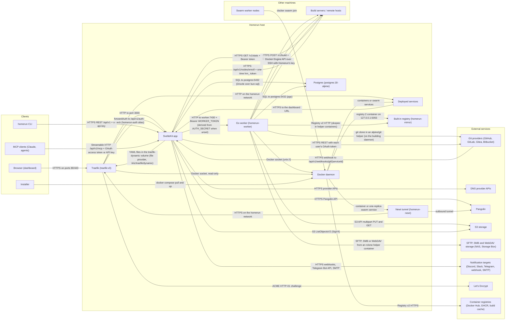

# Architecture

What runs where, who talks to whom, over what, and why. It's the map to read
before debugging a request that crosses two processes, or before adding a new
integration.

The shape in one paragraph: the SvelteKit app owns the database, the business
rules and every user-facing surface (dashboard, REST API, MCP server, webhooks).
It never touches Docker itself. The Go worker is the only process with a
read-write Docker socket: it runs the long jobs it leases from Postgres
(deploys, builds, scans, backups, cron runs, cleanups) and serves a small
authenticated HTTP API the app calls for everything Docker that a page is
waiting on. Traefik routes every hostname, reading container labels for services
and files the app writes for everything else. Everything outside the host is
optional and turned on from the dashboard.

## Diagram

<!-- architecture:start -->

<!-- Generated by scripts/generate-architecture.ts, run bun run gen -->

| From                                             | To                                                             | How                                                                                   | Why                                                                                                                  |
| ------------------------------------------------ | -------------------------------------------------------------- | ------------------------------------------------------------------------------------- | -------------------------------------------------------------------------------------------------------------------- |
| Browser (dashboard)                              | Traefik (`traefik:v3`)                                         | HTTPS on ports 80/443                                                                 | Reach the dashboard and every deployed app by hostname, with TLS.                                                    |
| Traefik (`traefik:v3`)                           | SvelteKit app                                                  | HTTP to port 3000                                                                     | Route the dashboard hostname to the app.                                                                             |
| Traefik (`traefik:v3`)                           | SvelteKit app                                                  | forwardAuth to `/api/v1/auth-check` (`homerun-auth` alias)                            | The per-app login wall: every request to a gated service is checked first.                                           |
| Traefik (`traefik:v3`)                           | Deployed services                                              | HTTP on the homerun network                                                           | Route slug.baseDomain and custom domains to each service's container port.                                           |
| SvelteKit app                                    | Traefik (`traefik:v3`)                                         | YAML files in the `traefik-dynamic` volume (file provider, `/etc/traefik/dynamic`)    | Dashboard router, redirects and custom certificates, which need no container and keep working when Docker is wedged. |
| Traefik (`traefik:v3`)                           | Let's Encrypt                                                  | ACME HTTP-01 challenge                                                                | Issue and renew TLS certificates for every routed hostname.                                                          |
| SvelteKit app                                    | Go worker (homerun-worker)                                     | HTTP to `worker:7430` + Bearer `WORKER_TOKEN` (derived from `AUTH_SECRET` when unset) | The app holds no Docker socket: status, start/stop, logs, terminal, stats and swarm calls all go through the worker. |
| SvelteKit app                                    | Postgres (`postgres:18-alpine`)                                | SQL to postgres:5432 (Drizzle over bun-sql)                                           | All state, and the job queue: the app queues and prepares jobs, then finalizes them.                                 |
| Go worker (homerun-worker)                       | Postgres (`postgres:18-alpine`)                                | SQL to `postgres:5432` (`pgx`)                                                        | Leases execute-stage job rows, heartbeats, writes deploy logs and results, so no job is lost on a restart.           |
| Go worker (homerun-worker)                       | Docker daemon                                                  | Docker socket (`unix://`)                                                             | The only read-write socket holder: deploys, builds, scans, backups, cron jobs, exec and logs.                        |
| Traefik (`traefik:v3`)                           | Docker daemon                                                  | Docker socket, read-only                                                              | Discover routers from container labels (Docker provider).                                                            |
| Docker daemon                                    | Deployed services                                              | containers or swarm services                                                          | Runs what you deploy.                                                                                                |
| Docker daemon                                    | Built-in registry (homerun-mirror)                             | `registry:2` container on `127.0.0.1:5055`                                            | Created on demand as the image mirror, optionally a private registry.                                                |
| Go worker (homerun-worker)                       | Built-in registry (homerun-mirror)                             | Registry v2 HTTP (skopeo in helper containers)                                        | Copies each deploy's image through the mirror so Trivy scans it before it runs.                                      |
| Docker daemon                                    | Container registries (Docker Hub, GHCR, build cache)           | Registry v2 HTTPS                                                                     | Pull service images; builds push to a build cache registry when one is set.                                          |
| Go worker (homerun-worker)                       | Build servers / remote hosts                                   | HTTPS `POST /v1/build` + Bearer token (worker in agent mode)                          | Build a git service on another machine without exposing its Docker daemon.                                           |
| Go worker (homerun-worker)                       | Build servers / remote hosts                                   | Docker Engine API over tcp:// (TLS) or ssh://                                         | The other build-server kind: build straight on a remote daemon.                                                      |
| Go worker (homerun-worker)                       | Build servers / remote hosts                                   | SSH with Homerun's key                                                                | Machine terminals: a browser shell on this server and every remote host.                                             |
| SvelteKit app                                    | Build servers / remote hosts                                   | HTTPS `GET /v1/stats` + Bearer token                                                  | Verify an agent's token before saving it as a build server.                                                          |
| Build servers / remote hosts                     | SvelteKit app                                                  | HTTPS `/api/v1/nodes/enroll` + one-time `hrn_` token                                  | The Add a server command installs and registers the machine itself.                                                  |
| Swarm worker nodes                               | Docker daemon                                                  | `docker swarm join`                                                                   | Extra capacity: swarm places replicas on joined nodes.                                                               |
| Go worker (homerun-worker)                       | Git providers (GitHub, GitLab, Gitea, Bitbucket)               | `git clone` in an `alpine/git` helper (on the building daemon)                        | Fetch the source for a git-based build.                                                                              |
| SvelteKit app                                    | Git providers (GitHub, GitLab, Gitea, Bitbucket)               | HTTPS REST with each user's OAuth token                                               | Connect accounts, browse repos, register webhooks, poll branches, read status checks.                                |
| Git providers (GitHub, GitLab, Gitea, Bitbucket) | SvelteKit app                                                  | HTTPS webhook to `/api/v1/webhooks/git/{serviceId}`                                   | Deploy on push and pull request previews.                                                                            |
| SvelteKit app                                    | DNS provider APIs                                              | HTTPS provider APIs                                                                   | Create and update records for every hostname a service answers on.                                                   |
| SvelteKit app                                    | Pangolin                                                       | HTTPS Pangolin API                                                                    | Create a resource and target per hostname when Pangolin is the DNS provider.                                         |
| Docker daemon                                    | Newt tunnel (homerun-newt)                                     | container or one-replica swarm service                                                | Runs the tunnel client when Pangolin's Newt credentials are set.                                                     |
| Newt tunnel (homerun-newt)                       | Pangolin                                                       | outbound tunnel                                                                       | Publish this host's routes with no inbound ports open.                                                               |
| Newt tunnel (homerun-newt)                       | Traefik (`traefik:v3`)                                         | HTTPS on the homerun network                                                          | Hand tunnelled requests to the usual Traefik routers.                                                                |
| Go worker (homerun-worker)                       | S3 storage                                                     | S3 API multipart PUT and GET                                                          | Stream volume backups up and restores down.                                                                          |
| SvelteKit app                                    | S3 storage                                                     | S3 ListObjectsV2 (SigV4)                                                              | List existing backups for the restore picker.                                                                        |
| Go worker (homerun-worker)                       | SFTP, SMB and WebDAV storage (NAS, Storage Box)                | SFTP, SMB or WebDAV from an rclone helper container                                   | Stream volume backups up and restores down, and list them for the restore picker.                                    |
| SvelteKit app                                    | Notification targets (Discord, Slack, Telegram, webhook, SMTP) | HTTPS webhooks, Telegram Bot API, SMTP                                                | Notifications, invites and emailed sign-in codes.                                                                    |
| homerun CLI                                      | SvelteKit app                                                  | HTTPS REST `/api/v1` + `x-api-key`                                                    | Deploy, inspect and manage from a terminal or CI.                                                                    |
| MCP clients (Claude, agents)                     | SvelteKit app                                                  | Streamable HTTP `/api/v1/mcp` + OAuth access token or API key                         | AI agents manage services; each tool calls the REST API as the caller.                                               |
| Deployed services                                | SvelteKit app                                                  | HTTPS to the dashboard URL                                                            | Sentry-compatible error ingest and Sign in with Homerun (OIDC).                                                      |
| Installer                                        | Docker daemon                                                  | `docker compose pull` and `up`                                                        | Install and upgrade the app, worker, Traefik and Postgres stack.                                                     |

<!-- architecture:end -->

## Reading it

- **Two ways into the worker, on purpose.** Anything that must survive a restart
  (a deploy, a backup) is a row in the `job` table that the worker leases and
  heartbeats. Anything a page is waiting on right now, or that streams (logs,
  the terminal, host stats), is an HTTP call to the worker. See
  [Scheduling and the job queue](scheduling.md).
- **Two ways into Traefik.** Services are routed from their container labels,
  which Traefik reads through its read-only Docker socket. The dashboard's own
  route, redirects and custom certificates are YAML files the app writes into a
  volume Traefik watches, so they don't depend on a container being recreated or
  on Docker answering. See [Networking](networking.md) and
  [Redirects](redirects.md).
- **Build servers are for building only.** A service always runs on this host
  (or on swarm nodes joined to it). See
  [Build servers & the Homerun Agent](remote-hosts-and-agent.md) and
  [Swarm mode](swarm-mode.md).
- **Pangolin or a DNS provider, not both.** One DNS integration runs at a time.
  See [DNS automation](dns-automation.md).

## How it's generated

`scripts/generate-architecture.ts` builds the section between the markers from
one typed list of components and edges, and runs as part of `bun run gen`, so CI
fails when the committed page is stale. It reads the installer's compose file
for what it can: the stack's services and images, the worker URL and port, the
database host, the Traefik flags and shared dynamic-config volume, and which
containers mount the Docker socket or get a `DATABASE_URL`. A new compose
service, socket holder or database client without an entry in the model fails
the script instead of silently going missing. Edit the model in the script,
never the generated block; the prose around it is hand-written.
