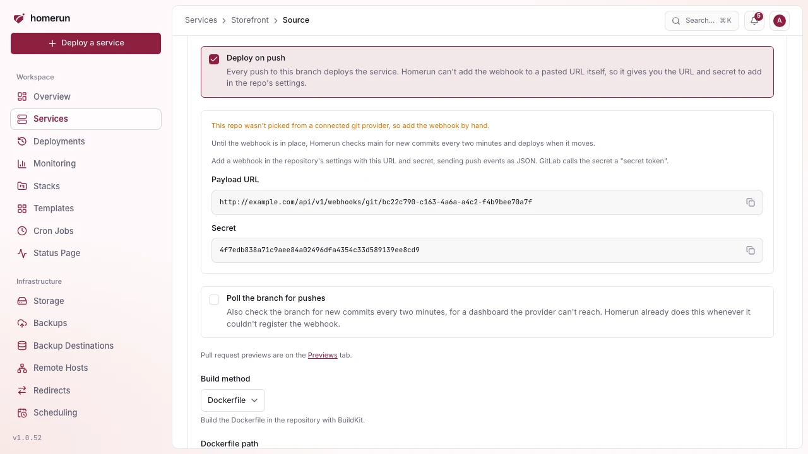

# Deploy on push

Turn on **Deploy on push** in the service's **Environments & Deployments →
Source** section (or in the wizard) and every push to the service's branch
deploys it, as its owner, without you touching the dashboard.

- **Picked from a connected account**: Homerun adds the webhook to the repo
  itself when you save, and removes it when you turn deploy-on-push off, switch
  repos or delete the service. The Source section says when it's registered.
- **A pasted clone URL**, or when Homerun couldn't register it (the account
  lacks webhook access, the provider couldn't be reached): the Source section
  shows a payload URL and a secret, with the reason. Add a webhook in the
  repository's settings with those, sending push events as JSON. On GitLab the
  secret goes in **Secret token**.

Pushes to other branches, tags and pings are acknowledged and ignored, and a
delivery with a wrong signature is refused. A service pinned to a commit SHA
never matches a push. Webhooks need the **Dashboard URL** set under Settings →
General, and that address has to be reachable from the git provider.
`GET /api/v1/services/{id}/webhook` returns the same URL and secret.

**Watch paths** skip pushes that don't touch the part of the repo a service
builds, for a monorepo. Under **Watch paths** and **Ignore paths** in the Source
section, one glob per line relative to the repo root (`apps/api/**`, `*.md`,
`docs`): a push deploys when at least one changed file matches a watch path (an
empty list watches every file) and no ignore path. `**` crosses folders and `*`
doesn't, a pattern without a slash matches a file name at any depth, and a
folder path covers everything under it. An environment uses its own lists,
copied from the service when it's created. Only webhook pushes that list their
files are filtered (GitHub, GitLab, Gitea): a Bitbucket push and a commit found
by polling always deploy. The API and Terraform call them `gitWatchPaths` /
`git_watch_paths` and `gitIgnorePaths` / `git_ignore_paths`.

**A dashboard the provider can't reach** (only on your LAN, behind a VPN):
whenever Homerun couldn't register the webhook, it polls the branch instead,
reading its head commit through the provider's API every two minutes with the
service owner's connection (or a token in the clone URL) and deploying when it
moves. The first read only records where the branch is. Tick **Poll the branch
for pushes** to poll even when a webhook is registered, for a provider that
accepts the webhook but can't deliver it. Polling needs a GitHub, GitLab, Gitea
or Bitbucket API, the same way status checks do.

**Reconnect to allow webhooks.** When the provider refuses to add the webhook (a
connection authorized without webhook access, a revoked token) or the service's
owner isn't connected any more, the Source section offers **Reconnect** right
there. It goes through the provider's consent screen, brings you back to the
Source section, and registers the webhook of every service of yours on that
provider that was missing one.

Without it, redeploy a git-mode service like an image-mode one: manually, or on
its own [cron schedule](scheduling.md#scheduled-redeploy).
