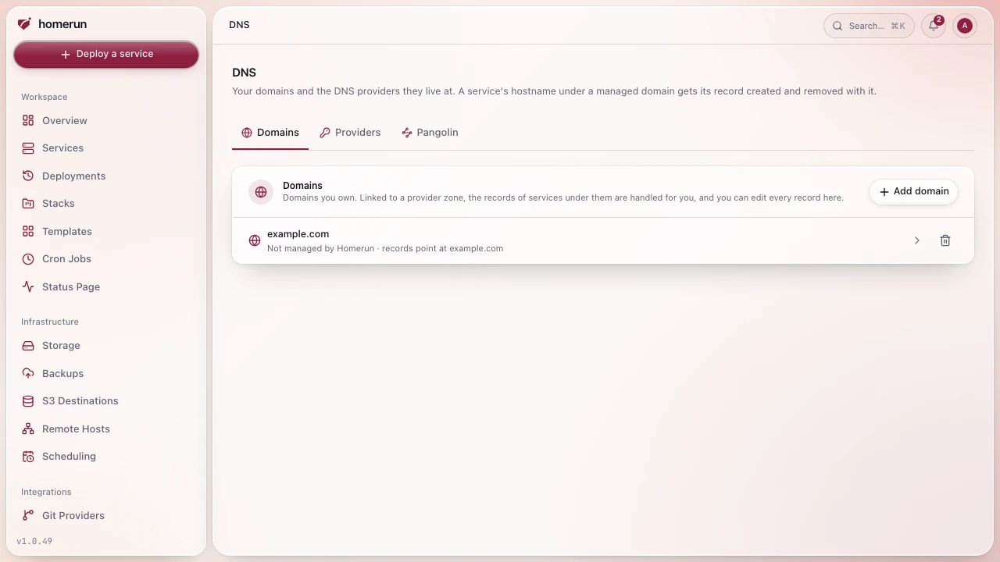
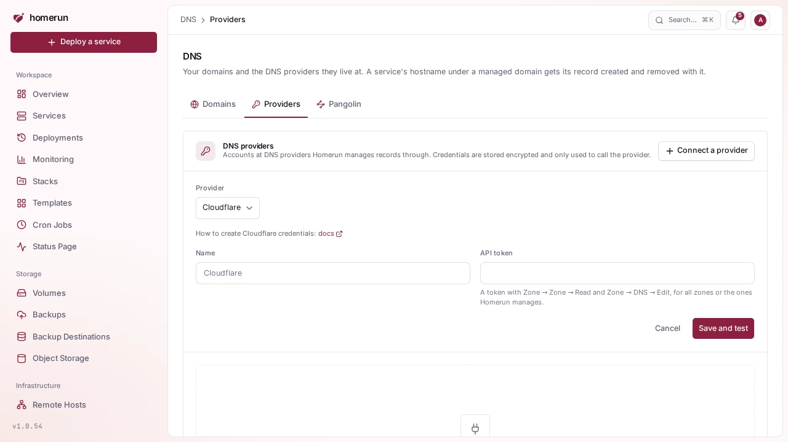
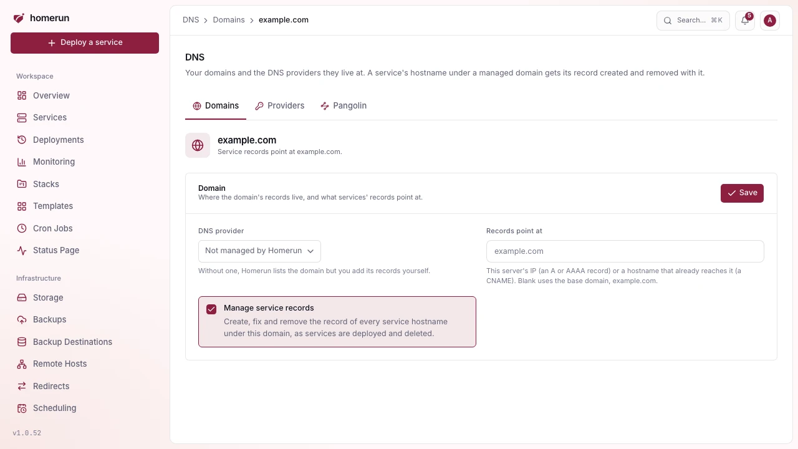
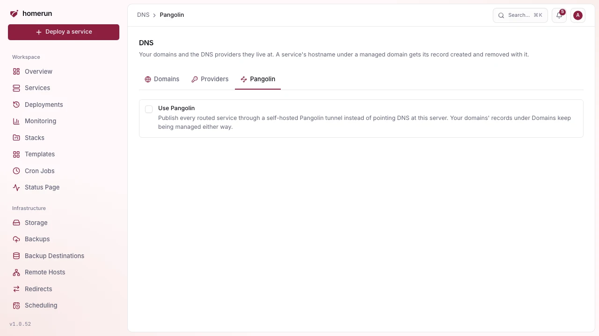

# DNS automation

The **DNS** page (sidebar → Integrations, needs the DNS permission) is where
Homerun manages your domains' DNS. It has three tabs: **Domains**, **Providers**
and **Pangolin**.

## Providers

A provider connection is an account at a DNS host Homerun can manage records
through. Add as many as you like, from any of these:

| Provider         | What to create                                                                                                                   |
| ---------------- | -------------------------------------------------------------------------------------------------------------------------------- |
| Cloudflare       | An API token with Zone → Zone → Read and Zone → DNS → Edit                                                                       |
| AWS Route 53     | An access key for an IAM user or role allowed `route53:ListHostedZones`, `ListResourceRecordSets` and `ChangeResourceRecordSets` |
| Google Cloud DNS | A service account JSON key with the DNS Administrator role                                                                       |
| Azure DNS        | An app registration (tenant, client id and secret) with DNS Zone Contributor                                                     |
| DigitalOcean     | A personal access token with the domain scopes                                                                                   |
| Hetzner          | A Hetzner Console API token (read & write) in the project holding the zones                                                      |
| Linode (Akamai)  | A personal access token with Domains read/write                                                                                  |
| Vultr            | An API key, with this server's IP on its access control list                                                                     |
| Namecheap        | API access enabled on the account, its API key, and this server's IP whitelisted                                                 |
| GoDaddy          | A production API key and secret (GoDaddy limits API access on small accounts)                                                    |
| Porkbun          | An API key and secret, with API access turned on for each domain                                                                 |
| Gandi            | A personal access token allowed to manage domains' technical configuration                                                       |
| OVHcloud         | An application key, application secret and consumer key for the `/domain` API                                                    |
| DNSimple         | An account access token                                                                                                          |
| deSEC            | A token                                                                                                                          |
| Scaleway         | An API secret key with DNS permissions                                                                                           |

Each connection's form links to the provider's own page on creating the
credentials, and says which permissions to grant. **Save and test** stores the
credentials encrypted and lists the zones they can see; **Test** does it again
later. Removing a connection keeps its domains, without their records being
managed any more.

## Domains

A domain is one you own, added to Homerun. Link it to a connection and pick the
zone it lives in, and:

- **Every service hostname under it gets its record.** A deploy creates it, a
  change of target fixes it, deleting the service or dropping the domain from it
  removes it. Turn **Manage service records** off to keep the domain listed
  without that.
- **Records point where you say.** **Records point at** takes this server's IP
  (an A or AAAA record) or a hostname that already reaches it (a CNAME). Blank
  uses the base domain, the way Homerun always did.
- **Its page lists every record under it** at the provider, live, with the ones
  Homerun created marked **managed**. Add, edit and delete records there, any
  type among A, AAAA, CNAME, TXT, MX and CAA.
- **Point at this server** creates the domain's apex and a wildcard
  (`*.example.com`) record in one go, so every name under it reaches the server
  without a record each. The apex needs an IP target, since DNS doesn't allow a
  CNAME there.

Homerun only ever changes or deletes the records it created itself. A record you
made by hand on a service's hostname is left alone and the deploy log says so;
removing a domain from Homerun deletes nothing at the provider.

Buying a domain isn't something Homerun does: register it at your registrar,
then add it here.

What a sync did is written into each deploy's own log
(`DNS (Cloudflare): app.example.com: created A → 203.0.113.10`), and a DNS
failure never fails the deploy itself.

Setting up Cloudflare during onboarding creates a Cloudflare connection and adds
your base domain in that zone. An instance that had Cloudflare configured before
this page existed gets the same, automatically, on upgrade.

## Pangolin

If you front the instance with a self-hosted
[Pangolin](https://github.com/fosrl/pangolin) tunnel, turn it on in the
**Pangolin** tab. Homerun then publishes every routed service through it (a
Pangolin Resource and Target per hostname) and runs its Newt tunnel client. Your
domains' records under **Domains** keep being managed either way, so don't link
a domain there whose names Pangolin serves.

**Pangolin** needs all of its fields, with any one blank the integration stays
off:

- **API base URL**: the **Integration API**, not the dashboard. Self-hosted
  Pangolin only exposes it once you enable it, it listens on its own port (3003
  by default), and its base path ends in `/v1`, e.g.
  `https://api.pangolin.example.com/v1`. A dashboard-style URL ending in
  `/api/v1` authenticates with a session cookie rather than an API key, so every
  call would fail.
- **Org ID** and an **API token** for it.
- **Main site name**: the Pangolin site (tunnel agent) whose host runs this
  instance's Traefik. It must already exist in Pangolin.
- Optionally a **target host**, the address the Pangolin site agent reaches
  Traefik at. Left blank it's detected: Traefik's container name when Newt runs
  as a container on the same network, `localhost` when it runs on this host with
  host networking. Set it when Newt runs on another machine. The page also tells
  you whether it found a Newt tunnel container on this host.
- Optionally the **Newt endpoint**, **Newt ID** and **Newt secret** from the
  site's page in Pangolin. With all three set, Homerun runs its own Newt tunnel
  client as a container named `homerun-newt` on the shared network next to
  Traefik. It isn't a service: it doesn't show up in your services list, it's
  recreated whenever you save these settings, and its logs are under System
  logs. Clear the fields to remove it. Leave them blank if Newt runs somewhere
  else. If you previously deployed Newt as a service yourself, delete that
  service first, two clients with the same credentials fight over the tunnel.
- Optionally a **target port**, defaulting to 443, where this instance's service
  routers live. A target on 80 reaches an entrypoint with no matching router and
  Traefik answers 404.
- **Let Pangolin handle sign-in**, off by default. On, the Resources Homerun
  creates keep Pangolin's own SSO and the [per-app login wall](login-wall.md)
  steps aside for anything Pangolin publishes, so visitors sign in once. Off,
  Homerun owns access and every Resource it creates has Pangolin SSO turned off.

**Test connection** checks the whole set rather than just that the token
authenticates. A missing or mistyped **Org ID** is caught first and named
directly ("Organization X doesn't exist…"), since Pangolin answers a list call
for an unknown org with an empty result rather than an error, which used to
surface as a confusing "no registered domain". It then confirms the site exists,
and that one of your registered Pangolin domains actually covers this instance's
base domain, since without that no service hostname could ever be routed. A
token-only check passed on setups that could never work. The domain must also be
**verified** in Pangolin, and a CNAME-type Pangolin domain only routes its own
exact name, never a subdomain of it. When several registered domains cover a
hostname, the most specific one is used.

Syncing Pangolin is safe to re-run too. An existing Resource for the hostname is
reused rather than duplicated: its SSO flag is changed only if it differs, and
its Target is repaired in place (host, port, scheme, site, enabled) instead of a
second one being added behind Pangolin's load balancer. A Resource you disabled
in Pangolin stays disabled, and the deploy log says so. Deleting a service
deletes its Resource, and one already removed by hand counts as done.

> Pangolin's side has been run against a real account and site, and passed.
> Cloudflare hasn't been exercised against a real account by the maintainer yet.
> Verify your own first real sync by reading the deploy log it writes to. See
> [FAQ & limitations](faq-and-limitations.md).
