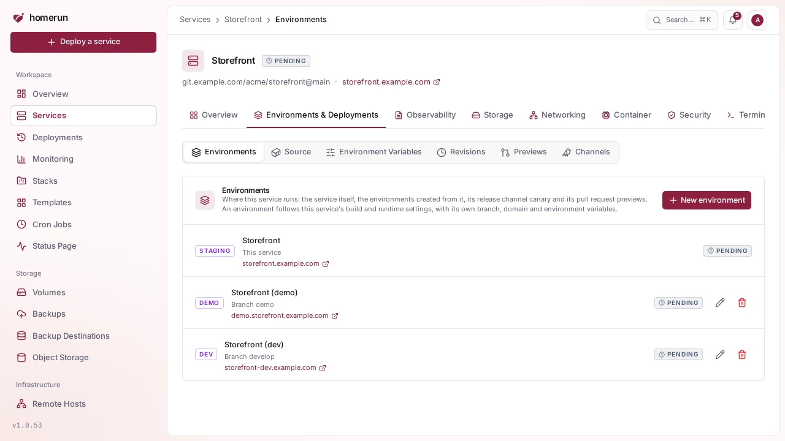
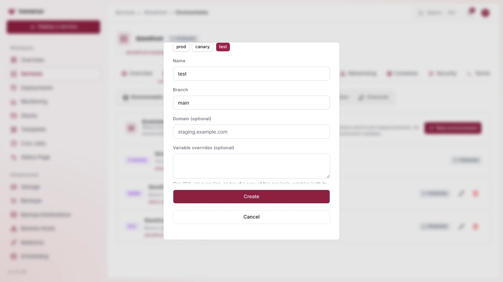
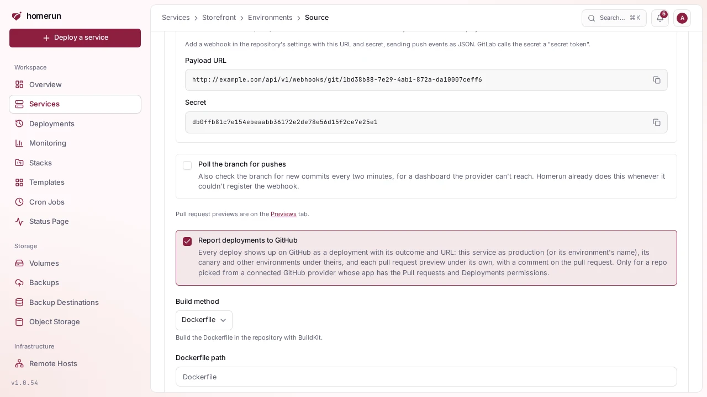

# Environments

A service's **Environments & Deployments** tab opens on its **Environments**:
every place the service runs. That's the service itself (`production`, unless
its Settings give it another environment name), the environments created from
it, its [release channel](release-channels.md) canary and its
[pull request previews](pull-request-previews.md). The tab's other sections are
the service's [source](deploy-source-and-builds.md),
[environment variables](env-vars.md), [revisions](revisions-and-rollback.md),
previews and channels.

## Creating an environment

**New environment** creates another deployment of the service under a name of
its own and, with **Deploy it now** ticked, deploys it right away (clear it to
set the environment's variables up first). Pick a preset (**prod**, **staging**,
**canary**, **test**, **dev** or **demo**, those the service doesn't use yet) or
type any name of up to 32 lowercase letters, digits and dashes. `preview` is
reserved, and `canary` is too while the service's release channels are on, since
their canary uses it.

- **Branch** (a service built from git) or **Image tag** (an image service):
  what the environment runs. It starts as the service's own.
- **Domain**: an extra hostname for it. It always gets its default one,
  `<service-slug>-<name>` under the instance's base domain.
- **Variable overrides**: `KEY=value` lines set on top of a copy of the
  service's environment variables, in which the service's own hostnames point at
  the environment instead.

An environment is a service of its own, listed under the service it came from,
with its own page, logs and deployments. It starts with a copy of the service's
build and runtime settings (build method, resources, healthcheck, port,
registry, login wall) and is independent from then on: change any of them, and
its environment variables, on its own tabs, and the service's later changes
don't reach it.

A git environment deploys on its own when its branch gets a push (through the
service's webhook, or by polling when there's none), if the service deploys on
push.

## Editing and deleting

The pencil changes an environment's branch or tag and domain, and sets more
variable overrides. Saving doesn't redeploy it: deploy it from its own page. The
bin deletes it, container, domains and DNS records included, leaving the service
and its other environments alone. Deleting the service deletes its environments
too.

## Reporting deployments to GitHub

With **Report deployments to GitHub** ticked (the default, under **Environments
& Deployments → Source**) and a repo picked from a connected GitHub provider,
every deploy shows up on GitHub as a deployment with its outcome, URL and log
link, posted as the service's owner: the service itself under `production`
(marked as GitHub's production environment) or its environment name, its canary
under `canary`, and each environment under its name. Pull request previews also
get a comment, see
[Reporting back to GitHub](pull-request-previews.md#reporting-back-to-github).
It needs the GitHub app's **Pull requests** and **Deployments** permissions
(Read and write), see [Connecting a git provider](git-providers.md). A report
that fails is logged and never holds up the deploy. Other providers get none.
