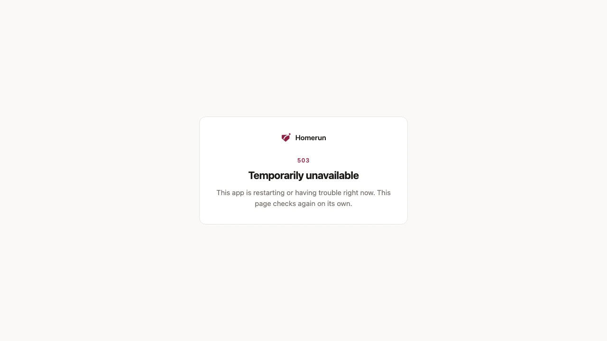
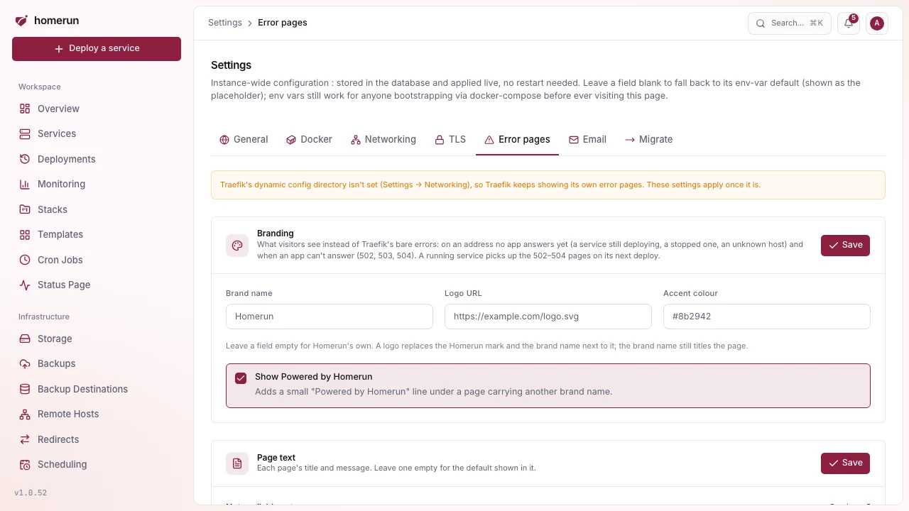

# Error pages

Traefik's own errors are a bare `404 page not found` or `Bad Gateway`. Homerun
replaces them with a branded page, so a visitor who arrives early or while an
app is down sees something that says what's going on.

## What shows when

- **Not available yet** (404): the address belongs to one of your services, but
  nothing answers on it, because the service is still deploying for the first
  time, or it's stopped. The page says the app is on its way.
- **Nothing here** (404): no service uses the address at all.
- **Temporarily unavailable** (502, 503, 504): the app's container exists but
  can't answer, because it crashed, it's restarting or it timed out.
- **Blocked path** (403): the path matches one of the service's
  [blocked paths](blocked-paths-and-ip-bans.md).

The first and last pages reload themselves every 15 seconds, so a visitor lands
on the app once it's up. An app's own error pages are left alone: its 404s pass
through untouched, and only the three gateway errors are replaced.

## Branding and text

**Settings → Error pages** sets the brand name, a logo URL (replacing the
Homerun mark), an accent colour, and each page's title and message. Leave a
field empty to keep Homerun's own. With another brand name, a small "Powered by
Homerun" line shows under the page unless you turn it off. Each page has a
**Preview** link.

The same brand name, logo, accent colour and "Powered by" line also dress the
sign-in pages of an app behind the [login wall](login-wall.md), so a visitor
never sees Homerun's name between your app and its sign-in. The dashboard's own
sign-in stays Homerun's.

## How it works

Homerun writes `homerun-error-pages.yml` into Traefik's dynamic config directory
(Settings → Networking). It holds:

- a catch-all router at the lowest priority, so any request no other router
  claims (a host no running service routes) gets the 404 page;
- an `errors` middleware that swaps a 502, 503 or 504 for the matching page;
- the middleware a service's blocked paths go through to reach the Blocked path
  page.

Every service deployed since carries that middleware. A service that was already
running picks it up on its next deploy; until then, Traefik's own gateway errors
still show for it, while the 404 pages work for every host straight away.

A service's DNS record (or Pangolin resource) is created when its deploy starts,
not when it finishes, so the address already reaches Traefik, and the "not
available yet" page, while the first deploy builds.

Without a dynamic config directory, nothing changes and Traefik keeps its own
pages. On a fresh hostname with no certificate yet (one issued over the HTTP
challenge), the browser warns about the certificate before showing the page; a
wildcard certificate for your base domain avoids that.
