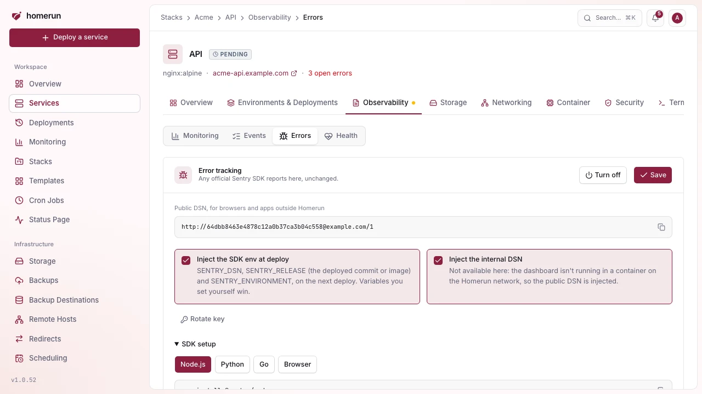
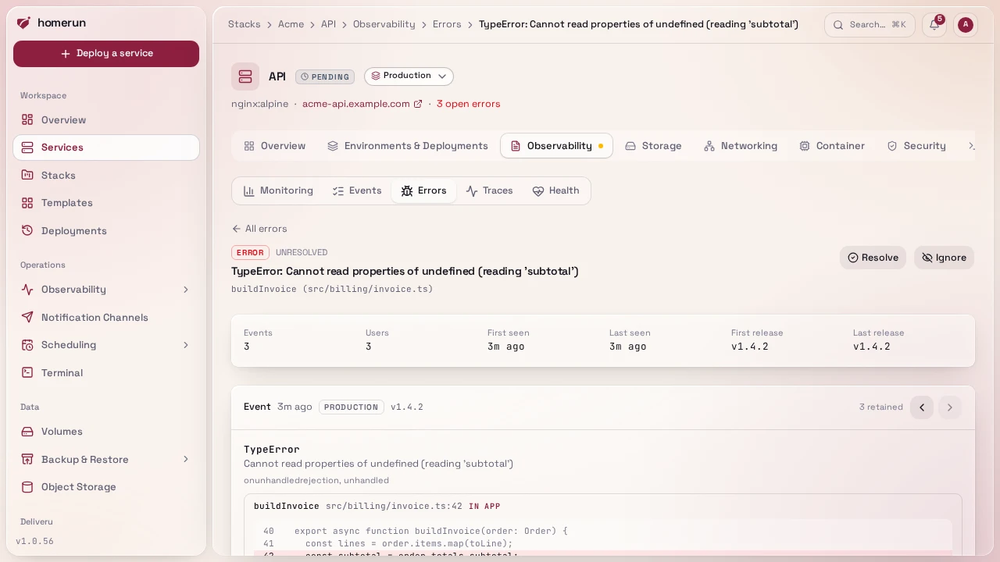
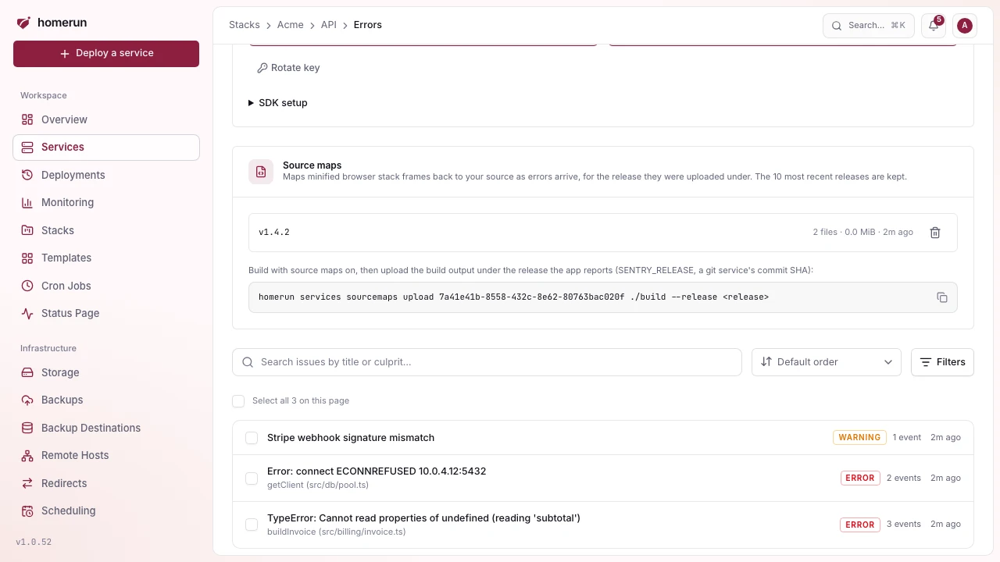

# Error tracking

Advanced mode: [simple mode](ui-modes.md) hides the Errors section of a
service's Observability tab. Everything here keeps working either way, and a
hidden page still opens from a link.

Homerun can collect the errors your apps throw, group them into issues, show
each one's stack trace next to the source code that raised it, and tell you
through your notification channels when a new issue appears or a resolved one
comes back. It speaks the Sentry protocol, so you use an official Sentry SDK
(Node, Python, Go, Ruby, PHP, Java, browser JavaScript…) unchanged and point it
at Homerun instead of sentry.io.

## Turning it on

Open a service's **Observability → Errors** section and turn on **Error
tracking**. Homerun creates a project for the service and shows its DSN, with
setup snippets for the common SDKs:

```text
https://<public key>@homerun.example.com/<project id>
```



With **Inject SENTRY_DSN, SENTRY_RELEASE and SENTRY_ENVIRONMENT** on (the
default), the next deploy adds those three variables to the service's env, so
the app only needs to initialise the SDK with no arguments:

- `SENTRY_DSN` points at the dashboard container over the Homerun network (plain
  `http://` to its network alias), so the app doesn't need to reach the
  dashboard's public URL. The public DSN in the section is for anything outside
  the host, such as a browser.
- `SENTRY_RELEASE` is the git commit the deploy built, or the image reference
  for an image service, so every event says exactly which code raised it.
- `SENTRY_ENVIRONMENT` is the service's [environment](release-channels.md)
  (`production`, a custom name, `canary` or `preview`).

A variable the service already sets itself is never overwritten. Pull request
previews and the release-channel canary report to their parent's project, with
`preview` or `canary` as their environment, so you see every environment's
errors in one place.

The Dashboard URL (Settings → General) has to be set for the public DSN to show.

## Issues

Events that are the same error are grouped into one **issue**, with a count and
the first and last time it was seen. Events are grouped by:

1. the `fingerprint` the SDK sends, when it sends one (`{{ default }}` in it
   stands for the grouping below);
2. otherwise the exception type and the app's own stack frames (function, module
   and file, ignoring line numbers, so a small edit elsewhere in the file
   doesn't split the issue);
3. otherwise the message, with numbers, ids and hex addresses ignored.

An issue is **unresolved**, **resolved** or **ignored**. Resolve one once you've
shipped a fix; if it happens again it's **regressed**: it goes back to
unresolved and you're notified. An ignored issue still counts its events but
never notifies. The Errors section lists issues with a status filter and search,
and resolves or ignores several at once.


## Back to the source

An issue's page shows the exception (and the chain of exceptions that caused
it), its stack trace with your own frames open and library frames folded, the
lines of code around each frame when the SDK sends them (most server-side SDKs
do), plus the request, user, tags and breadcrumbs of the event, and the other
events of the issue: the arrows step to the older or newer one, and each event
has its own link to share.



For a service built from a git repository, each of your own frames has a **View
in repo** link to that file and line at the exact commit that ran: the event's
release when it's a commit, otherwise the deployment that was live when the
event happened. Build directories such as `/app/`, `/usr/src/app/` or
`/workspace/repo/` are stripped to get the path inside the repository. GitHub,
GitLab, Gitea and Bitbucket URLs are supported.

## Source maps

Browser JavaScript is minified, so its stack traces point at
`https://app.example.com/_app/immutable/app.3f2a.js:1:48213` in a function named
`t`. Upload the build's source maps and Homerun maps those frames back to the
original file, line, function name and surrounding source as each error arrives
(and groups issues on the real function names).

1. Build with source maps on: `build.sourcemap: true` in Vite (SvelteKit, Vue,
   React with Vite), `productionBrowserSourceMaps: true` in Next.js,
   `devtool: "source-map"` in webpack.
2. Upload the build output under the release the app reports, the
   `SENTRY_RELEASE` it sends (Homerun injects the commit SHA for a git service):

   ```sh
   homerun services sourcemaps upload <service id> ./build --release <release>
   ```

   Every `.map` file under the directory is sent under its path relative to it,
   which has to be the path the minified file is served at
   (`./build/_app/x.js.map` covers `https://<app>/_app/x.js`). The API
   equivalent is a multipart `POST /api/v1/services/{id}/sourcemaps` with a
   `release` field and one field per map named after its path.

Maps apply to errors that arrive after the upload; errors already stored keep
their minified frames. The service's **Errors** section lists the releases with
maps, and deletes one; `homerun services sourcemaps list <id>` and
`homerun services sourcemaps delete <id> <release>` do the same. Only the 10
most recent releases are kept, and a map can be at most 25 MiB. A map doesn't
need to be served publicly, so you can keep it out of the deployed image.



## Notifications

A new issue sends the `error.issue.new` event and a regression sends
`error.issue.regressed`, both to the in-app notifications and to every
[notification channel](notifications.md) subscribed to them, with the service,
the error, its location, its count and a link to the issue. At most 10 of each
are sent per service per hour, so an app stuck in an error loop can't flood a
channel; new issues and regressions have separate allowances, so a burst of new
issues never hides a regression.

## Limits

- An event body is at most 1 MB, and each project takes at most 120 events a
  minute. Past that the SDK is told to back off (`429` with `Retry-After`), the
  standard Sentry rate-limit answer.
- Stack traces are trimmed to 60 frames and 5 chained exceptions, breadcrumbs to
  the last 50, and long values are shortened.
- Each issue keeps its latest 100 events. Events older than 30 days are deleted,
  and so are resolved or ignored issues with nothing newer.
- Only errors are stored. Performance traces, sessions, replays and attachments
  are accepted and dropped, so SDKs that send them don't retry.
- Minified browser JavaScript is only mapped back to its source once its
  [source maps](#source-maps) are uploaded. Server-side stack traces are shown
  as sent.

## From the API, CLI and MCP server

`GET /api/v1/services/{id}/errors` lists a service's issues,
`GET /api/v1/services/{id}/errors/{issueId}` returns one with its latest event,
and `PATCH` on it changes its status. The CLI has
`homerun services errors <id>`, and the MCP server `list_errors` and
`get_error`, so an assistant can read the stack trace while it debugs. See
[API & CLI](api-and-cli.md).
