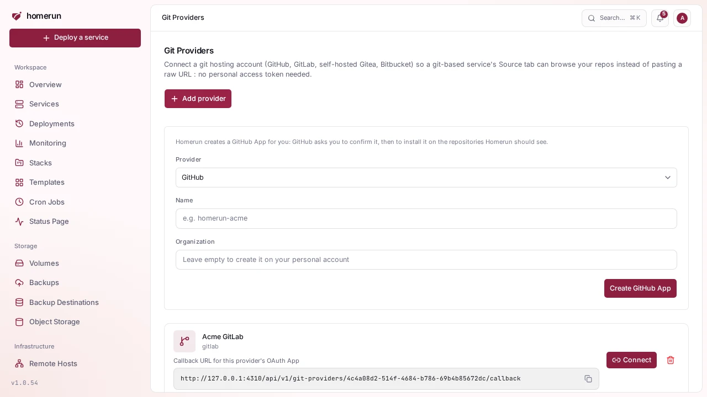

# Connecting a git provider

`Git Providers` in the sidebar is what turns "paste a clone URL" into "browse my
repos", and it's how a private repo works without putting a token in the URL. It
takes two steps, done by different people:

1. **Someone with write access to Git providers registers the provider**, once.
   For **GitHub**, give the app a name (and an organization, or leave it empty
   for your personal account) and click **Create GitHub App**: GitHub asks you
   to confirm the app, then to install it on the repositories Homerun should
   see. Nothing to copy by hand. The app only asks for what Homerun uses: read
   access to code, commit statuses and checks, and write access to repository
   webhooks, pull requests and deployments (the last two for
   [pull request previews](pull-request-previews.md)). To give it more
   repositories later, change the installation on GitHub. **An app created
   before previews reported to GitHub** lacks the pull request and deployment
   permissions, and GitHub answers "Resource not accessible by integration": in
   the app's settings on GitHub, under **Permissions**, give it **Read and
   write** on **Pull requests** and **Deployments**, save, then accept the new
   permissions on its installation (**Settings → Applications → Installed GitHub
   Apps → Configure**). Reconnecting isn't needed. A repo that already has
   Homerun's webhook (from a deleted app or an earlier connection) keeps it:
   Homerun takes it over and updates its secret and events instead of adding a
   second one, which GitHub and Gitea refuse. For GitLab, self-hosted Gitea
   (which also wants its base URL) or Bitbucket, register an OAuth application
   on that provider's own site and paste the client id and secret in. The page
   prints the exact callback URL to register on the provider's side.
2. **Each person connects their own account** from the same page, one click
   through the provider's consent screen. Connections are per-account: your
   token is yours, and another user connecting to the same provider gets their
   own.

Once connected, a service's **Environments & Deployments → Source** section (and
the new-service wizard) picks the repository and branch from that account
instead of asking for a clone URL, and checks the repo for a `Dockerfile`.
Picking one also turns on [Deploy on push](deploy-on-push.md), with the webhook
added for you. **Use a clone URL instead** is still there for any other repo.
Tokens are stored encrypted, refreshed automatically when the provider issues
short-lived ones, and disconnecting removes them.

Cloning itself is provider-agnostic, so any public HTTPS git URL works with no
provider connected at all.

**Connections made before deploy-on-push existed** only allowed reading repos on
GitLab, Gitea and Bitbucket. The Source section offers to reconnect them once
Homerun is refused; until then it shows the webhook to add by hand. **Gitea
keeps the old read-only permissions across a reconnect**: it reuses the
authorization it already has for Homerun without asking again. Revoke Homerun
under Gitea's **Settings → Applications → Authorized OAuth2 Applications**
first, then reconnect, and Gitea asks for the new permissions.
