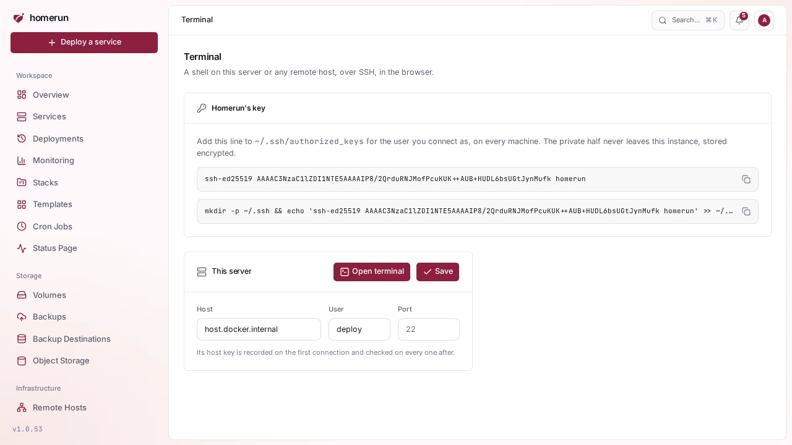

# Machine terminals

Advanced mode: [simple mode](ui-modes.md) hides the Terminal sidebar entry.
Everything here keeps working either way, and a hidden page still opens from a
link.

**Terminal** in the sidebar (Infrastructure, admins only) opens a shell on the
machines themselves, in the browser: this server and every
[remote host](remote-hosts-and-agent.md). It's SSH from Homerun's worker, so the
machine only needs an SSH server and Homerun's public key. A service's own
container has its own Terminal tab, see
[Observability](observability.md#terminal).

## Setting it up

1. Open **Terminal**. The first visit generates Homerun's SSH key pair
   (ed25519). The private half stays on the instance, encrypted like every other
   secret.
2. Copy the public key, or the one-line install command under it, and run it as
   the user you want to connect as on each machine. It appends the key to that
   user's `~/.ssh/authorized_keys`.
3. On the machine's card, fill in **Host**, **User** and, if it isn't 22,
   **Port**, then **Save**. **Open terminal** appears once both host and user
   are set.

For **This server**, the connection starts inside the worker container, so
`localhost` is the container itself. Use `host.docker.internal`, which the
installer's compose file points at the host. A remote host takes the address the
worker can reach it on, the same one you'd `ssh` to.

## Host keys

The first connection records the key the machine presents, and every connection
after that must present the same one. If it doesn't, the terminal refuses to
open ("the machine's host key changed") rather than hand your session to
whatever answered. The card shows the key it trusts.

After you reinstall a machine or regenerate its host keys, clear the card's
host, save, then put the host back and save again: changing the host forgets the
recorded key, and the next connection records the new one.

## What to expect

- The shell is the user's login shell on a real PTY (`xterm-256color`), resized
  with the browser window. `sudo`, `htop`, `vim` and friends work.
- An idle session closes after 15 minutes, like a container terminal. Closing
  the tab ends the shell.
- Only admins see the page, and a session is only readable by the user who
  opened it.
- "The machine refused Homerun's key" means the key isn't in that user's
  `authorized_keys` yet, or the file's permissions are too open for `sshd`.

## Git over SSH

Pushing to a self-hosted Gitea or GitLab over SSH is a published port on that
service, not a machine terminal: publish its SSH port on the host (for example
`2222 → 22`) and tell the app which port it's reachable on. See
[Published ports](networking.md#published-ports).
