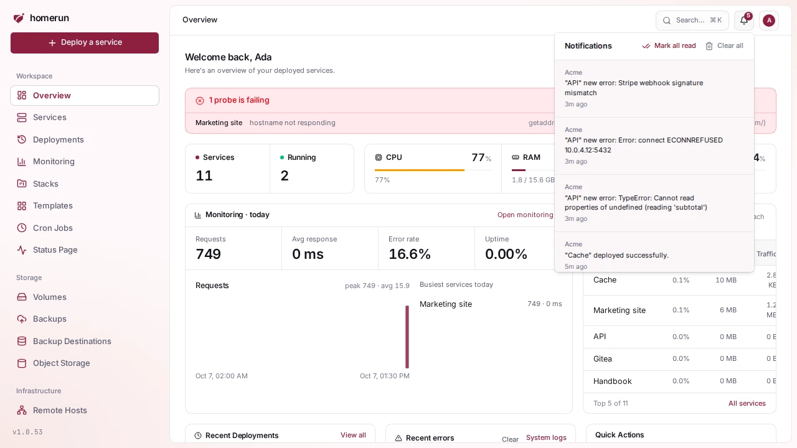
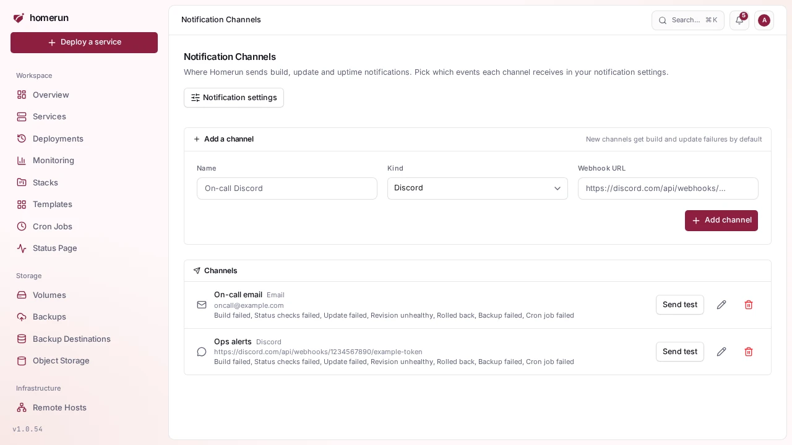
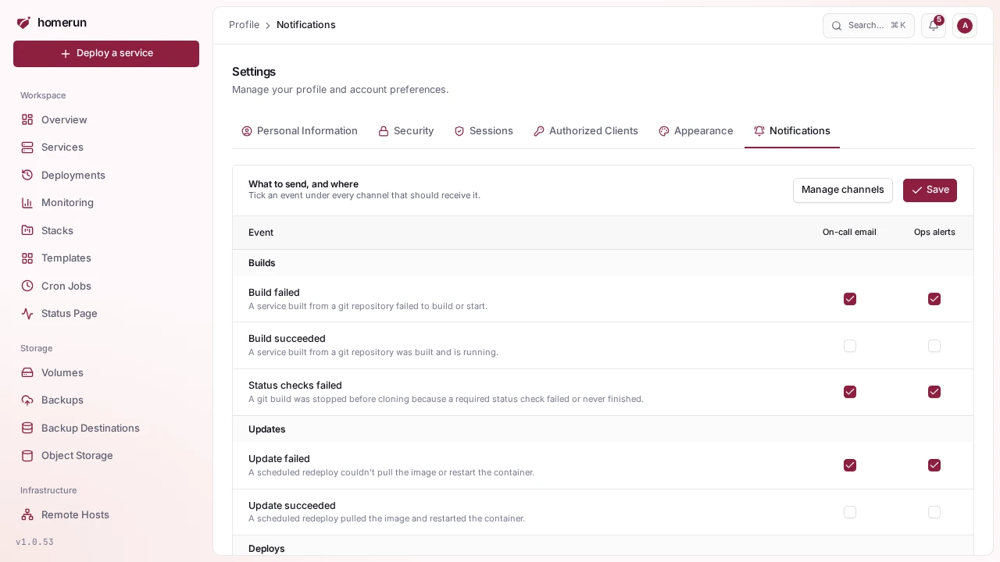

# Notifications

The bell in the header opens **Notifications**, a per-account feed of lifecycle
events on every service, whoever created it (each account gets its own copy to
read and clear): deploy succeeded or failed, a build stopped by status checks,
an unhealthy or rolled back revision, service created, started, stopped, an
image scan finding a critical vulnerability, and runtime errors attributed to a
service, plus the server crossing a resource limit. The bell shows how many are
unread. Click an entry to jump to its service and mark it read, use **Mark all
read**, drop one with its `x`, or **Clear all**.

While anything is unread, the [dashboard](dashboard.md) shows a summary at the
top: how many, the latest five, and links to mark them all read or open the
page.

Scheduled work reports once per run in the feed too: the outcomes of cron
redeploys, scheduled backups and cron jobs are held like the channel summary
below, then show up as one `Scheduled tasks: 14 ok` entry listing every outcome
by event, failures first with their errors, which opens **Scheduling**. A run
with a single outcome keeps that outcome's own entry.

**Browser notifications**: click **Turn on browser notifications** on the
Notifications page (or in the dashboard summary) and allow them, and every new
notification also pops up as a desktop notification while a Homerun tab is open
in that browser, checked every 30 seconds. Clicking one opens what it's about.
The button disappears once the browser has allowed or blocked them; change that
from the browser's site settings.

It's deliberately a short curated list, not a log: everything Homerun logs at
warn or error level is persisted separately and shown on the relevant service's
[Observability → Events](observability.md#errors). Old notifications are trimmed
automatically, so the feed doesn't grow without bound.

**Notification channels** send the same kind of events outside the dashboard.
Add a Discord webhook, a Slack incoming webhook, a Telegram bot, a generic
webhook, or an email address under **Notification Channels** in the sidebar,
then pick which events each one gets under **Profile → Notifications**: build
succeeded/failed, a build stopped by failing [status checks](status-checks.md),
scheduled update succeeded/failed, manual deploy succeeded/failed, a new
revision found unhealthy or [rolled back](revisions-and-rollback.md), an image
scan finding [critical vulnerabilities](image-scanning.md), a service going down
or recovering (from its [uptime probe](observability.md#uptime)), the server
crossing a [resource limit](dashboard.md) or recovering from one, a new or
regressed [error issue](error-tracking.md), a [volume backup](backups.md)
succeeding or failing (after its retry), a
[backup destination running low on space](backups.md#storage-space), a
[cron job](scheduling.md) run succeeding or failing, and an address
[banned for hitting blocked paths](blocked-paths-and-ip-bans.md). A new channel
starts subscribed to build and update failures, status checks failures,
unhealthy revisions, rollbacks, both resource alerts, new and regressed errors,
backup failures, low backup storage, and cron job failures; turn on the rest you
want from that matrix.

Notifications close together are grouped instead of arriving one by one. The
first one goes out straight away; any that follow within a minute of the
previous one are held and sent as a single message once a minute passes with
nothing new (five minutes at most), titled like
`3 notifications: 2 ok, 1 failed`, with a section per event (failures first),
each listing its notifications one per line, and the error of each failure. The
outcomes of scheduled work (cron redeploys, scheduled backups and cron jobs) are
always held until every scheduled job still queued or running has finished,
retries included, then sent as one `Scheduled tasks: …` summary, so a nightly
run reports once (after an hour at most). A channel only ever gets the events it
subscribes to: when only one of a group's is left for it, it gets that
notification unchanged. Held notifications live in memory, so a restart while
they wait drops them.

A **Send test** button on each channel fires a sample notification so you can
check the destination actually works before relying on it. A delivery failure is
shown right on the channel rather than failing silently, and retried in the
background through the job queue: first after 30 seconds, then after 20, 40 and
80 more, four tries in all, visible as **Notification** jobs in the Scheduling
page's job queue. A retry is dropped once the channel is removed, disabled or
unsubscribed from that event, and a successful one clears the error. The test
button isn't retried. Email channels need SMTP configured first, see
[Configuration](configuration.md).

The pencil button on a channel edits its name and destination, and turns it off
or back on: a disabled channel keeps its settings but gets nothing until it's
enabled again. Saving clears the channel's last delivery error. Its kind can't
change; remove it and add a new one instead. A Telegram channel's bot token
field starts blank: leave it blank to keep the stored token.

- **Slack**: create an
  [incoming webhook](https://api.slack.com/messaging/webhooks) for the channel
  and paste its `https://hooks.slack.com/services/…` URL.
- **Telegram**: create a bot with @BotFather, add it to the group or channel,
  then enter the bot token and the chat id (a number like `-1001234567890`, or a
  public channel's `@name`). The token is stored with the channel but never
  shown again, the list only shows the chat.
