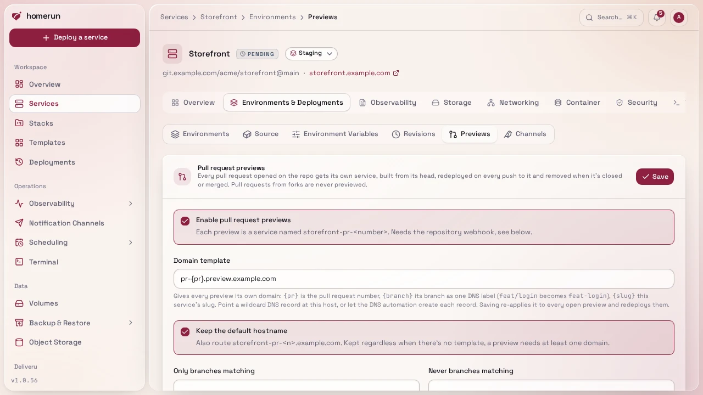
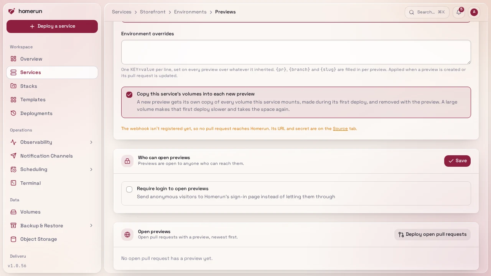
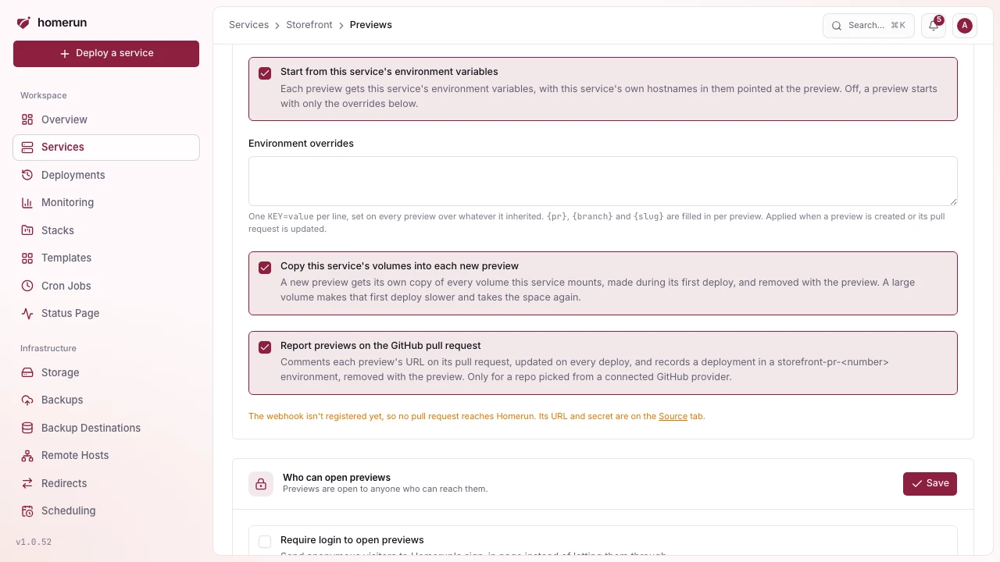
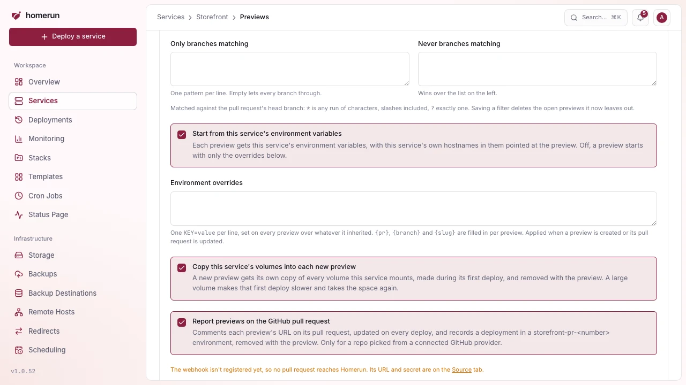
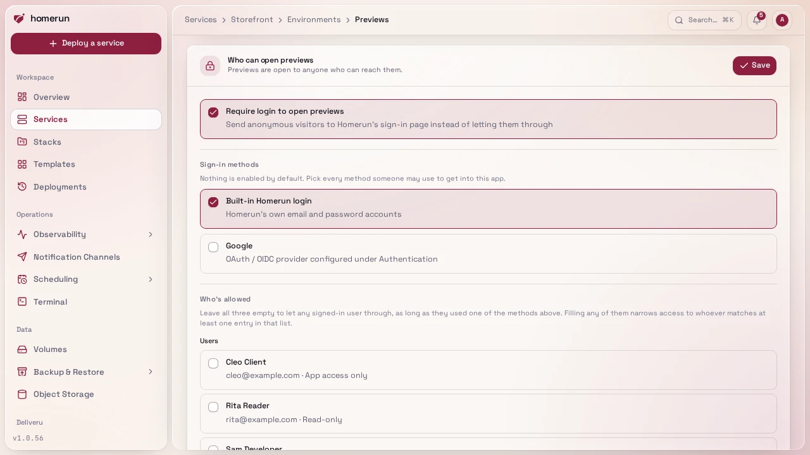
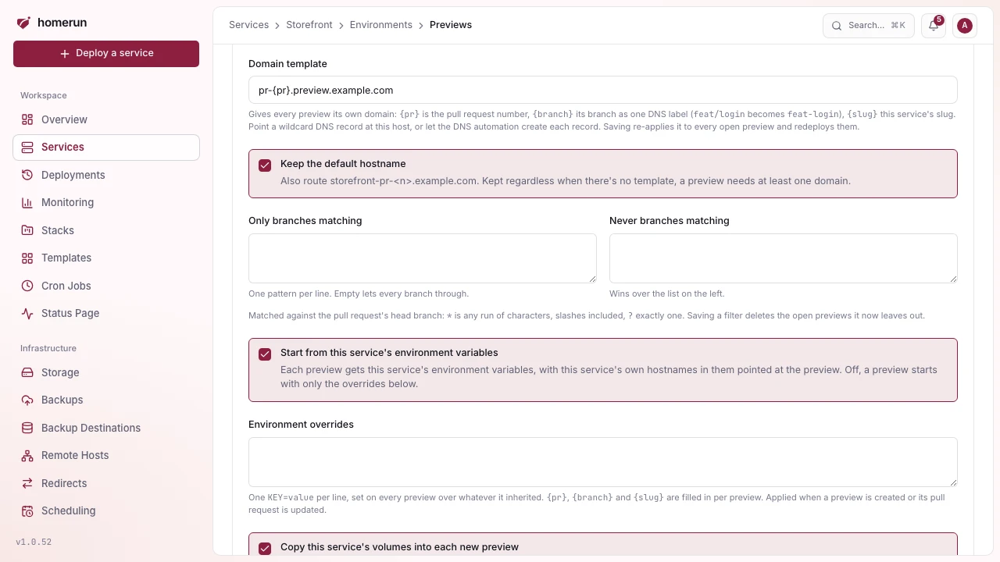

# Pull request previews

Advanced mode: [simple mode](ui-modes.md) hides the Previews section of a
service's Environments & Deployments tab. Everything here keeps working either
way, and a hidden page still opens from a link.

Tick **Enable pull request previews** in a git service's **Environments &
Deployments → Previews** section and every pull request opened on its repo gets
a service of its own, `<slug>-pr-<number>` (so
`<slug>-pr-<number>.<baseDomain>`), built from the pull request's head and
deployed as the service's owner. Each push to the pull request redeploys the
preview; closing or merging it deletes the preview, container, DNS records and
all. GitHub, Gitea and GitLab previews build the exact head commit; Bitbucket
only sends an abbreviated hash, so its previews build the head branch, which
covers every pull request previews are made for anyway.

A service whose CI builds and pushes its own image gets previews too, created by
the pipeline instead of the webhook, see
[Previews of an image-based service](#previews-of-an-image-based-service).

**Pull requests from forks are never previewed.** On a public repo anyone can
open one, and a preview builds and runs its code with the service's env vars.
Homerun only previews a pull request whose head is positively the same
repository as its base (GitHub and Gitea compare the head and base repository,
GitLab the source and target project, Bitbucket the source and destination
repository); a fork, or a payload that doesn't say, is acknowledged and ignored.

Pull requests that were already open when previews were turned on never sent an
event, so they get no preview on their own. **Deploy open pull requests**, in
the header of the **Open previews** list, asks the provider for the repo's open
pull requests and deploys a preview for each one, with the same fork and
branch-filter rules; a preview already building its pull request's head is left
alone. It needs the repo picked from a connected git provider, and reads the
first page only (100 pull requests, 50 on Gitea and Bitbucket). On GitHub, the
app needs the **Pull requests** permission, see
[Connecting a git provider](git-providers.md).

A preview copies the service's build settings, env vars, resources, healthcheck
and stack when it's created and again on every update, but not its volumes,
domains, cron schedule, status checks or login wall: previews have their own
access rules, see
[Sharing a preview with a client](#sharing-a-preview-with-a-client). The
Previews section lists the open ones with their status and domains, a
**Redeploy** and a **Delete** button (a push to its pull request brings a
deleted one back), and a **Domains** link to the preview's own Networking tab.
Each preview is a normal service you can open too. Previews aren't rows of their
own on the services list or a stack's page: each one is listed under the service
it previews, in the list and in the dependency tree, and searching for a
preview's branch or title finds its parent. A preview takes its parent's stack,
icon and category. Any of the service's own hostnames in its env vars (an
`ORIGIN`, a public URL) are replaced with the preview's main hostname, so a
preview doesn't send its visitors, cookies or CSRF checks to the real site.
Turning previews off, switching the service between a git repo and an image, or
deleting the service, deletes every preview.

## Reporting back to GitHub

With **Report deployments to GitHub** ticked (the default, under **Environments
& Deployments → Source**), a repo picked from a connected GitHub provider gets
two things on each pull request with a preview, posted as the service's owner:

- a comment with the preview's URLs, the commit it was built from and a link to
  the deployment log, edited in place on every deploy rather than posted again,
  and rewritten to say the preview was removed when it goes;
- a GitHub deployment to an environment named after the preview
  (`<slug>-pr-<number>`), so the pull request shows **View deployment** and its
  status. Removing the preview marks its deployments inactive and deletes the
  environment, which GitHub only allows when the owner is an admin of the repo;
  otherwise the inactive environment stays listed in the repo's settings.

The same setting reports the service's other deploys too, see
[Environments](environments.md#reporting-deployments-to-github).

## Environment variables and data

A preview starts from the service's environment variables, with any of the
service's own hostnames in them pointed at the preview. Turn off **Start from
this service's environment variables** and a preview starts with none of them,
which is the safe choice when the service's env holds production credentials.

**Environment overrides**, one `KEY=value` per line, are set on every preview on
top of whatever it inherited: point it at a preview database, turn a feature
flag on. `{pr}`, `{branch}` and `{slug}` in a value are filled in per preview,
so `DATABASE_URL=postgres://app@db/app_pr_{pr}` gives each pull request its own
database. Overrides are applied when a preview is created and whenever its pull
request is updated.

**Copy this service's volumes into each new preview** gives a new preview its
own copy of every volume the service mounts, mounted at the same path, so it
starts with real data without touching the service's. The copy is made during
the preview's first deploy (a large volume makes that deploy slower, and takes
the space a second time) and never again, so what the preview writes survives
its redeploys. The copies show on the Storage page as the volume's name with
`(PR #n)`, and are deleted with the preview. Turning the option on doesn't copy
anything into previews that already exist.

## Choosing which branches get previews

**Only branches matching** and **Never branches matching**, in the Previews
section, filter pull requests by their head branch, one glob pattern per line:
`*` is any run of characters, slashes included, and `?` is exactly one. With
nothing in the first list every branch qualifies; with patterns there, a branch
has to match one. A branch matching the second list never gets a preview, even
when the first one lets it through, so `feat/*` in the first and `*/wip` in the
second previews `feat/login` but not `feat/wip`. A typical use is keeping bots
out: `dependabot/*` and `renovate/*` in the second list.

The filter applies to every pull request event: an update to a pull request
whose branch is left out deletes its preview if it had one. Saving a changed
filter deletes the open previews it now leaves out straight away. The API's
`PATCH /api/v1/services/{id}` takes the same lists as `previewBranchInclude` and
`previewBranchExclude`.

## Sharing a preview with a client

**Who can open previews**, in the Previews section, is a login wall for every
preview of the service, separate from the service's own wall on its Security
tab: production can stay public while previews are for your team and a client.
It takes the same settings as a service's wall (the sign-in methods it accepts
and the users, emails and groups it lets in) and applies them to each preview
when it's created and again on every push to its pull request, so a wall set
here can't be lost to a push. Saving it re-applies it to the open previews at
once, redeploying the ones whose wall was switched on or off.

To show a client a pull request before it's merged:

1. On **Users**, invite the client with the **App access only** role. They can
   accept with a password or with emailed codes, and they never see the
   dashboard.
2. In the service's **Previews** section, turn on the wall under **Who can open
   previews**, tick **Emailed code** (or whichever methods they use), and pick
   the client in the allowed users or add their email.
3. Send them the preview's link. After signing in they're let through, and their
   `/my-apps` page lists every preview shared with them with its pull request
   title.

Services that had a login wall before this setting existed start with their own
wall copied into it, so their previews stay gated as before.

## Domains

A preview gets `<slug>-pr-<number>.<baseDomain>` by default. A **domain
template** gives each one its own domain instead, or as well:

- `{pr}` is the pull request number: `pr-{pr}.preview.example.com`.
- `{branch}` is its branch as one DNS label, in lower case with anything that
  isn't a letter or digit turned into a dash: `feat/Login` gives `feat-login`.
- `{slug}` is the service's slug.

The template must contain `{pr}` or `{branch}`, so every preview gets a
different domain. Point a wildcard DNS record (`*.preview.example.com`) at the
host, or let the [DNS automation](dns-automation.md) create one record per
preview; either way Traefik gets a certificate per preview domain. A template
domain that another service already routes is skipped for that preview, which
keeps its default hostname.

**Keep the default hostname** decides whether previews still answer on
`<slug>-pr-<number>.<baseDomain>` alongside the template's domain. It stays on
regardless when there's no template, since a preview needs at least one domain.

Saving a changed template or default-hostname setting re-applies it to every
open preview right away: their domains and DNS records are replaced and the
deployed ones are redeployed so Traefik picks the new routes up. Domains added
by hand on a preview's Networking tab are replaced along with them.

Previews ride on the same webhook as deploy on push: turning them on
re-registers the webhook to also send pull request events. A webhook added by
hand needs **Pull requests** (GitHub, Gitea), **Merge request events** (GitLab)
or the **Pull request** created, updated, merged and declined triggers
(Bitbucket) ticked too. Polling doesn't cover pull requests.

Previews combine with [release channels](release-channels.md) on the same
service: pull requests get previews, the canary branch deploys the canary and
matching tags deploy the service itself. See
[Main is canary, tags are stable](main-canary-tags-stable.md).

## Previews of an image-based service

An image-based service has no repo for Homerun to watch, so its CI creates the
previews: after pushing the pull request's image, it runs
`homerun previews deploy <service> <pr> --tag <tag>`. With **Enable pull request
previews** ticked in the service's **Environments & Deployments → Previews**,
the first call for a pull request creates `<slug>-pr-<number>` the same way a
git preview is created: the service's settings, env vars and overrides, domain
template, login wall, stack, icon and category, plus volume copies when that
option is on. The preview runs the service's own image at that tag, pulled with
the service's registry credentials. Each later call switches the preview to the
new tag and redeploys it, without copying volumes again. The command waits until
the preview is healthy, prints its URL, and exits non-zero when the deploy fails
or `--timeout` (default `20m`) passes.

- `--commit <sha>` records the commit the image was built from on the preview's
  revision, so the command waits for that exact deploy, and
  `homerun previews wait --commit` and `homerun previews promote --commit` match
  it. Redeploys of the same tag keep it.
- `--branch <branch>` runs the branch filter, see
  [Choosing which branches get previews](#choosing-which-branches-get-previews):
  a branch it leaves out is refused, and loses the preview it had. Without
  `--branch` no filter applies.
- `--title <title>` is the pull request's title shown in the Previews section.

There's no webhook to delete the preview when the pull request closes, so the
pipeline does it with `homerun previews delete <service> <pr>`; a preview whose
pull request closed without that stays until it's deleted by hand. Forks are up
to the pipeline as well: Homerun can't tell where an image came from, so skip
pull requests from forks in the workflow. A git service refuses the command (its
previews come from the webhook), and so does a service with previews off.
**Deploy open pull requests** and **Reporting back to GitHub** only apply to git
services. [Deploying from CI](ci-cd.md#previews-from-ci) has a complete GitHub
Actions workflow.

## Testing previews from CI

`homerun previews wait <service> <pr> --commit <sha>` blocks until a pull
request's preview runs that commit and is healthy, then prints its URL, and
`homerun previews promote <service> <pr>` deploys the preview's exact image to
the service, with no rebuild. The same endpoints are under
`/api/v1/services/{id}/previews` (see [API & CLI](api-and-cli.md#previews)).
[Testing pull requests with GitHub Actions](github-actions-preview-testing.md)
puts them together: E2E tests against every preview, and shipping the image that
passed.
