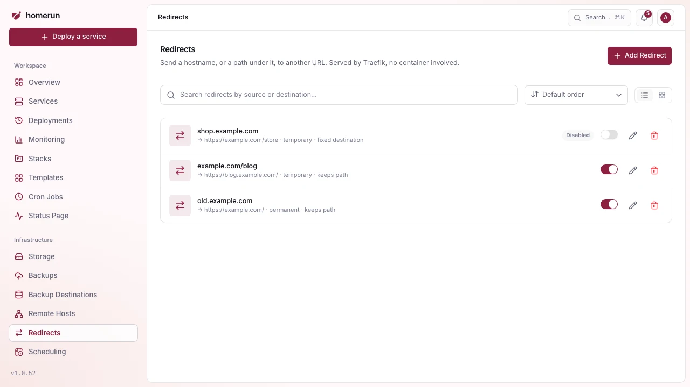
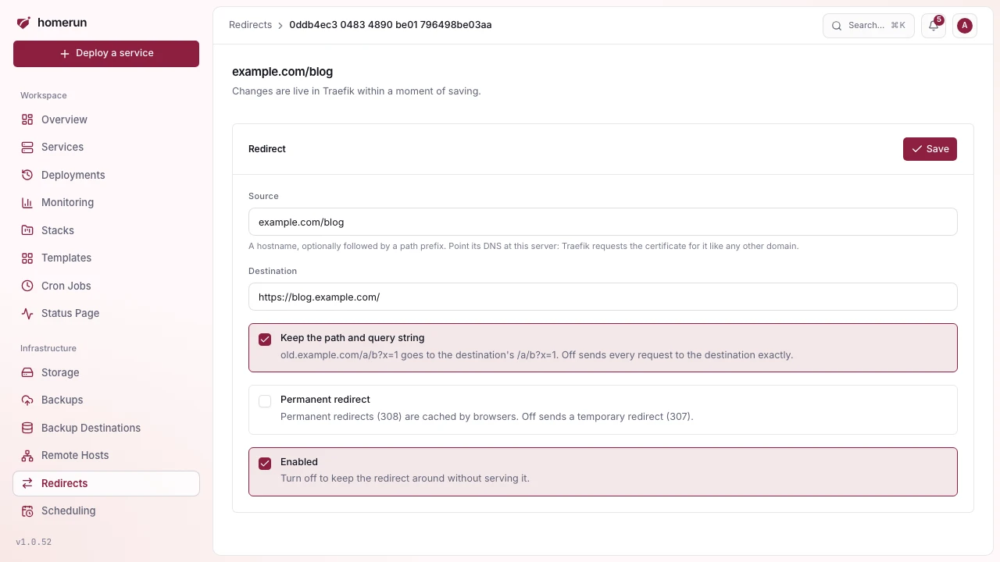

# Redirects

**Redirects** (sidebar, Infrastructure) sends a hostname, or a path under one,
to another URL. Traefik answers the request itself, no container is involved.

Each redirect has:

- **Source**: a hostname (`old.example.com`) or a hostname plus a path prefix
  (`example.com/blog`). The prefix matches on a path boundary: `/blog` and
  `/blog/post` match, `/blogger` doesn't.
- **Destination**: a full `http://` or `https://` URL.
- **Keep the path and query string**: on, `old.example.com/a/b?x=1` goes to
  `https://new.example.com/a/b?x=1` (with a path prefix, the prefix is dropped
  and the rest is appended to the destination). Off, every request goes to the
  destination exactly as written.
- **Permanent redirect**: on sends a 308, off a 307. Browsers cache permanent
  redirects, so start temporary while testing.
- **Enabled**: off keeps the redirect around without serving it.

Each source can only have one redirect. A redirect on a hostname or path a
service also routes wins over that service, its blocked paths and login wall
included.

## How it's served

Every create, edit and delete rewrites one Traefik file-provider file
(`homerun-redirects.yml` in the dynamic config directory, the same place custom
certificates and the dashboard's own route live), and the app rewrites it again
on boot. Traefik watches the directory, so a change is live within moments with
no restart. On an instance with no dynamic config directory, nothing is written
(see [Networking](networking.md)).

The source hostname also goes through the same DNS automation as a service's
domains (see [DNS automation](dns-automation.md)): a record under a managed
domain, or a Pangolin resource, is created when the redirect is enabled and
removed when it's disabled or deleted, and every redirect is synced again on
boot. A hostname a service already routes is left to that service. Without DNS
automation, point the hostname at this server yourself. Traefik requests a
certificate for the source like it does for any domain, unless your instance
certificate already covers it.

The list has a switch per redirect to turn it on or off without opening it.

## API, CLI and MCP

`GET|POST /api/v1/redirects` and `GET|PATCH|DELETE /api/v1/redirects/:id` manage
them (`PATCH` changes only the fields sent, `{"enabled": false}` turns one off).
The CLI has `homerun redirects list|get|create|update|enable|disable|delete`,
and the MCP server `list_redirects`, `create_redirect`, `update_redirect` and
`delete_redirect`.
