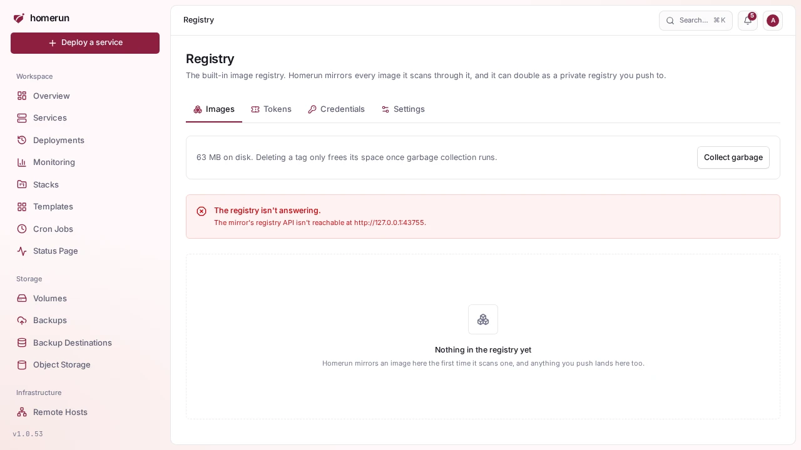
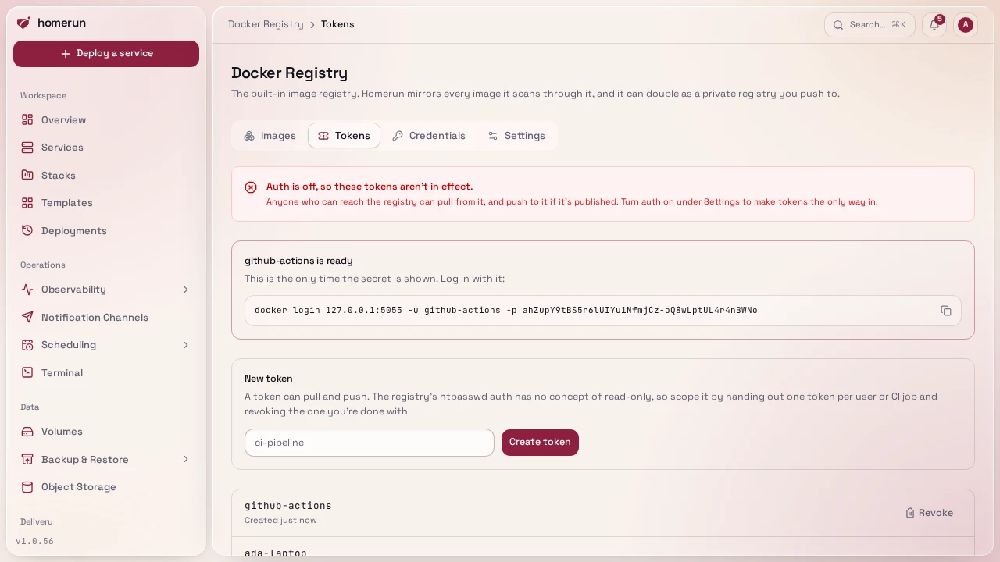
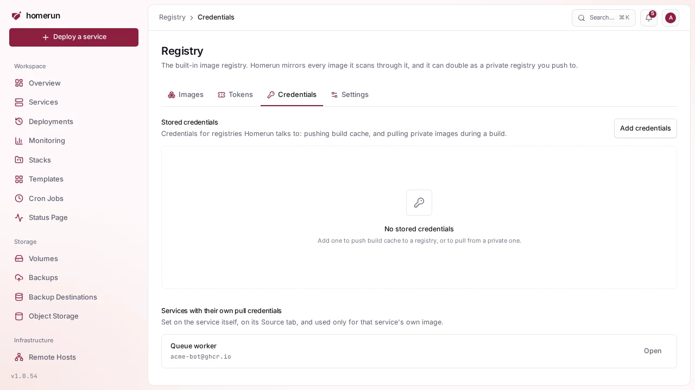
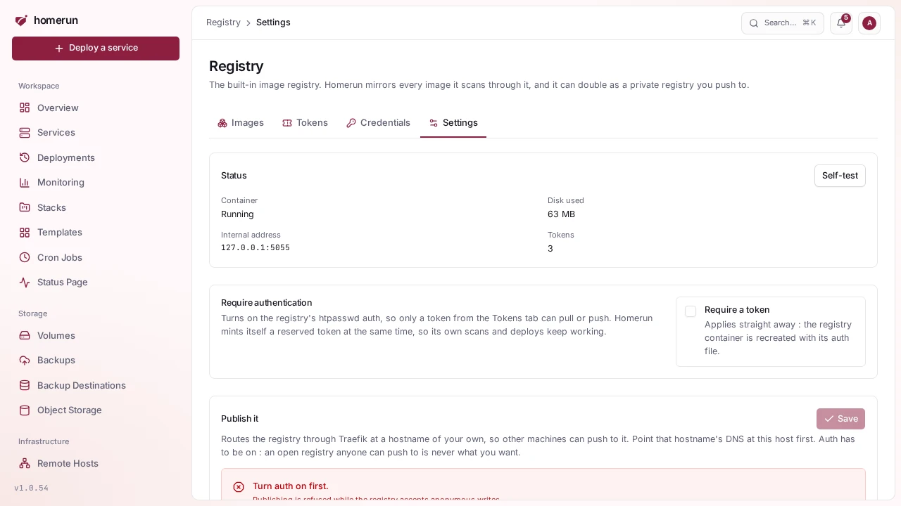

# Registry

Advanced mode: [simple mode](ui-modes.md) hides the Registry sidebar entry.
Everything here keeps working either way, and a hidden page still opens from a
link.

`/registry` (admin-only, under **Administration** in the sidebar) turns
Homerun's internal image mirror into a real private Docker registry: a place you
can `docker push` to, not just something Homerun mirrors scans through. It's
four tabs: **Images**, **Tokens**, **Credentials** and **Settings**.

## Images

Every repository the registry holds, one row each with its first tags and the
services whose image lives there (an image lands here the first time
[image scanning](image-scanning.md) mirrors it, or the moment you push to it).
The list loads in the background, a page of repositories at a time in name
order, and the search box narrows it to the repositories whose name contains
what you type. **Collect garbage** runs garbage collection on demand, the same
cleanup [Docker Cleanup](docker-cleanup.md#image-mirror) runs nightly and on its
own **Clean up mirror** button, so it doesn't fight the scheduled job.

Click a repository for its own page: a `docker pull` command to copy, links to
the services using it, and every tag with the digest it points at and a button
to copy its full image reference. From there you can delete a single tag, or the
whole repository with **Delete repository**.

Deleting a tag only frees disk once garbage collection actually runs. **Registry
deletes work on the manifest, not the tag**: if two tags point at the same
image, deleting one deletes the other too. A service that's already running a
deleted image keeps running; it just can't be pulled again until it's
re-mirrored or pushed back.

## Tokens

A token is what a `docker login` uses to push or pull. Creating one asks for a
username and hands back a generated secret and a ready-to-paste
`docker login <host> -u <user> -p <secret>` line — **shown exactly once**, never
stored or recoverable, so save it before you navigate away. Revoking a token
removes it immediately, since revoking rewrites the registry's auth file and
reloads it.

**Every token can both push and pull.** The registry's htpasswd-based auth has
no concept of scopes or read-only access without running a separate token
server, so there's no way to hand out a pull-only credential here. Scope access
by handing out one token per person or CI job and revoking the ones you're done
with, rather than sharing one.

While **Require authentication** (Settings tab) is off, tokens exist but aren't
enforced: anyone who can reach the registry can pull, and push if it's
published.

## Credentials

Not new storage: this tab just surfaces two things that already live elsewhere
so you don't have to go hunting for them —

- the stored upstream registry credentials from
  [`/build-cache-registries`](deploy-source-and-builds.md#build-servers-and-build-cache),
  with a link to edit each one;
- every service that carries its own pull credentials in its **Environments &
  Deployments → Source** section, with a link straight to that service.

## Settings

- **Status**: whether the container is running, disk used, its internal address,
  and how many tokens exist. **Self-test** checks that the registry answers
  Homerun's own credentials and, once it's published, that `https://<host>/v2/`
  answers over a certificate that verifies and asks for a token. A failure says
  why, including when Traefik serves its own default certificate because no
  HTTPS router matches the host.
- **Require authentication**: turns on htpasswd auth, so only a Tokens-tab
  credential can pull or push. The moment this turns on, Homerun mints itself a
  reserved internal token so its own mirror-and-scan pipeline keeps working
  without you doing anything.
- **Publish it**: routes the registry through Traefik at a hostname of your
  choosing, so another machine can `docker push`/`docker pull` against it over
  the network instead of only from this host. Saving the hostname also creates
  its DNS record (or Pangolin resource, with Pangolin's sign-in off, since
  `docker login` can't follow it) at the configured DNS provider, and removes
  the previous hostname's.

**The safety rule is enforced by the app, not just the form**: you can't turn
authentication off while the registry is published at a hostname, and you can't
publish it while authentication is off. A registry reachable from the internet
always requires a token.

## What's verified

A real `registry:2` container with a Bun-generated bcrypt htpasswd was driven
directly: an anonymous request and a wrong password both got a 401, the correct
token got a 200, and a real `docker login` followed by `docker push` succeeded,
with the pushed image showing up in the catalogue. **Not yet verified**: pushing
through a _published_ Traefik hostname with a real TLS certificate, only the
container's own auth was exercised directly.
