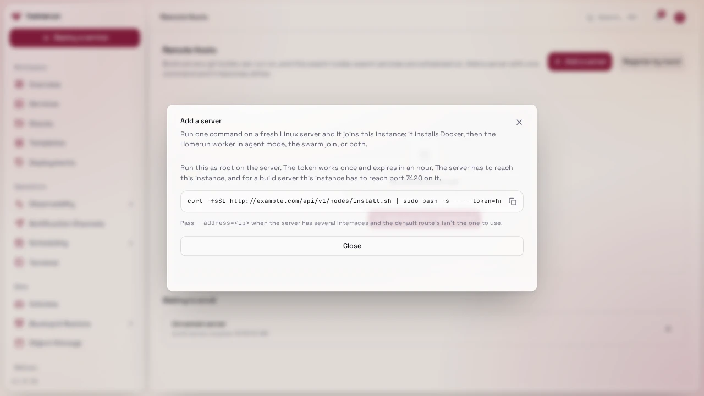
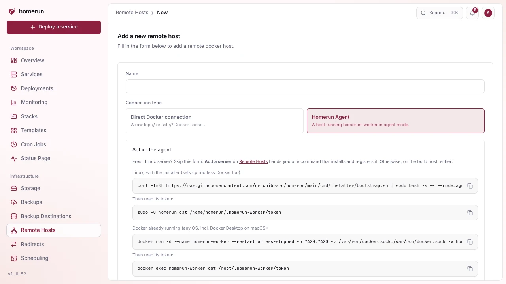

# Build servers & the Homerun Agent

Advanced mode: [simple mode](ui-modes.md) hides the Remote Hosts and Build Cache
sidebar entries. Everything here keeps working either way, and a hidden page
still opens from a link.

Services always deploy to this host's own Docker daemon. Placement across
machines is [swarm mode](swarm-mode.md)'s job: a second machine joins the swarm
as a worker rather than being registered separately, see
[Adding a server with one command](#adding-a-server-with-one-command).

A **remote host** is therefore a _build server_: somewhere a git-based service's
image gets built instead of on this machine, then brought back here to run.

## Adding a server with one command

On `/remote-hosts`, **Add a server** (needs write access to Remote hosts) turns
any fresh Linux server into a build server, a [swarm](swarm-mode.md) node, or
both. Pick the roles and an optional name, and Homerun hands you a command:

```sh
curl -fsSL https://<your instance>/api/v1/nodes/install.sh | sudo bash -s -- --token=hrn_...
```



Run it as root on the server. It installs Docker, then:

- as a **build server**, installs the Homerun worker in agent mode (the same
  release as your instance) and registers it under Remote Hosts, named after the
  server unless you gave a name;
- as a **swarm node**, joins your swarm as a worker. Swarm nodes need swarm mode
  on (Settings → Docker).

The token works once and expires after an hour; pending ones are listed under
**Waiting to enroll**, where you can revoke them. The server has to reach your
instance, and for a build server your instance has to reach port 7420 on the
server. Homerun and the other nodes reach the server at its default route's
address; pass `--address=<ip>` when that's the wrong interface.

In swarm mode, the **Swarm nodes** table lists every node with its state,
address and resources. Removing a worker there moves its replicas to the other
nodes; run `docker swarm leave` on it afterwards.

Homerun doesn't add or remove servers by itself when load changes: you add
capacity with the command above.

## Registering a build server by hand

From `/remote-hosts` → **Register by hand**: a name, plus a connection type:

- **Direct Docker connection**: `tcp://host:port` (+ optional TLS client cert
  for a secured Docker API), or `ssh://user@host`, pointed at the target daemon
  directly.
- **Homerun Agent**: a URL + bearer token for a host running the standalone
  agent binary instead, see [Homerun Agent](#homerun-agent) below. The form
  shows copy-ready commands to start the agent (the installer on Linux, or
  `docker run` anywhere Docker runs, macOS included) and to read its token,
  pinned to your instance's release. **Test connection** checks the URL and
  token without saving; the token is verified again before the host is saved.
  This is the lighter-weight alternative that doesn't require exposing the
  Docker daemon itself.



Either kind builds: a Docker-connection host runs the build directly against
that daemon's Docker API, an agent host through its own `POST /v1/build`.

`/remote-hosts` has a search box and a Connection-type filter (Docker
socket/Homerun Agent) once you have more than a couple registered, plus a pager
if you have more than a page's worth, searched/paginated server-side.

## Getting the image back here

The built image only exists on the build server's own daemon, so it has to reach
this host before the container can start. Two ways, picked by whether the
service has a **build cache registry** (a registry credential registered under
`/build-cache-registries` and picked in the service's
[Environments & Deployments → Source](deploy-source-and-builds.md#deploy-source-image-or-git-repo)
section):

- **With a cache registry**, the build pushes the final image there and this
  host pulls it back. The same registry doubles as the layer cache, so a repeat
  build reuses what the last one pushed.
- **Without one**, the image is streamed straight from the build server into
  this host's daemon: `docker save` on the build server piped into `docker load`
  here, through the Docker connection itself or the agent's
  `GET /v1/images/save`. Nothing to set up, but every deploy transfers the whole
  image rather than only the layers that changed.

The `git clone` runs on the build server itself for both connection kinds (in a
throwaway `alpine/git` container on its daemon), so the repository has to be
reachable from the build server rather than from here. The build runs there too,
with BuildKit in a `docker:cli` helper container that mounts the build server's
`/var/run/docker.sock` (the agent uses its own `DOCKER_SOCKET_PATH`).

## Homerun Agent

Not a separate program any more: `homerun-worker` (`cmd/worker/`), the same
binary the app itself runs next to, picks **agent mode** whenever it starts with
no `DATABASE_URL` set. In agent mode it exposes git builds and host stats over a
small token-authenticated HTTP API, the alternative to registering a build
server by raw `tcp://`/`ssh://` socket. Instead of exposing (or SSH-tunneling
into) the daemon itself, the build server runs the worker in agent mode and the
main app talks to it over plain HTTP with a bearer token, this is what the
"Homerun Agent" connection type on `/remote-hosts` (above) registers.

```sh
go run ./cmd/worker   # from the repo root; agent mode as long as DATABASE_URL is unset, talks to /var/run/docker.sock by default
```

Or compiled to a standalone binary (no Go toolchain needed on the target host):
`bun scripts/build-packages.ts` (builds the CLI/installer/worker binaries for
both arches). On first boot with no `WORKER_TOKEN` set, it generates one and
prints it, copy that plus this host's reachable URL into `/remote-hosts`'s "new
host" form, see [`cmd/worker/README.md`](../cmd/worker/README.md) for the full
env var and HTTP surface reference, plus install options (a Docker image, a
prebuilt binary, or the installer below).

**Wired into the main app**: registering an agent-kind build server and picking
it in a git-based service's Environments & Deployments → Source section routes
that service's builds through this agent's HTTP API instead of a raw Docker
connection.

## Installer

`cmd/installer/` automates standing up a fresh Linux box with either the full
stack, on the system Docker daemon as a swarm manager (or on rootless Docker in
standalone mode with `--docker=rootless`), or the Agent alone, on its own
rootless daemon. This is what `docs/getting-started.md`'s one-liner runs, and
`--migrate-to-rootful` moves an older rootless install onto the system daemon in
swarm mode. See [`cmd/installer/README.md`](../cmd/installer/README.md) for
flags and what's verified.

A separate script, `cmd/installer/swarm-join.sh`, joins a box to an **existing**
Homerun swarm as a worker and installs the Homerun Agent there (through the
installer's `--mode=agent`). This is how you add capacity: the swarm scheduler
places workloads on the new node automatically. Registering it as a build server
(above) is separate and only needed if you also want to build there. Run it with
the join token/manager address from `docker swarm join-token worker` on your
manager:

```sh
curl -fsSL https://raw.githubusercontent.com/orochibraru/homerun/main/cmd/installer/swarm-join.sh \
  | sudo bash -s -- --token=<SWMTKN-...> --manager=<ip>:2377
```

The node joins on the **system (rootful)** Docker daemon, same as the manager
runs on (see [swarm mode](swarm-mode.md)): rootless Docker can't create the
overlay networks swarm services use. Nodes need to reach each other on 2377/tcp,
7946/tcp+udp and 4789/udp. On a host with several network interfaces add
`--advertise-addr=<ip>`. Verified against two real disposable VMs: the worker
joins, replicas get scheduled on it and Traefik on the manager serves them over
the overlay network.
