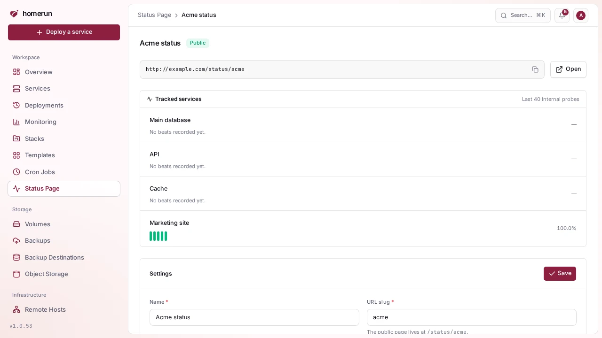
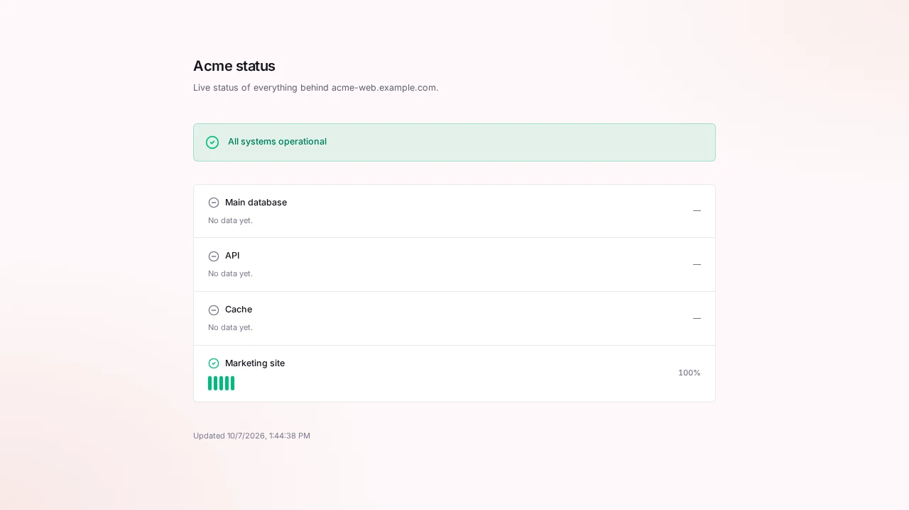

# Status pages

**Status Page** in the sidebar builds an uptime page out of your services'
[uptime probes](observability.md#uptime). Each page has a name, a slug and an
optional description, and covers one of three sets: **every service**, **one
stack**, or **services you pick**. Its page in the dashboard shows each
service's recent heartbeats and uptime percentage.

With **services you pick**, open the **Services** box and type to search; arrow
keys move through the list, Enter adds or removes the highlighted service,
Escape closes it. Picked services are listed under the box, each with a remove
button. Pull request previews and release-channel canaries aren't offered on
their own: a picked service that has (or can get) them shows **Include previews
and canary** instead. Tick it and the page lists that service's canary and every
open preview right under it, worked out each time the page loads, so a new pull
request shows up and a closed one drops off without editing the page. It's off
by default. **Every service** and **one stack** already list previews and
canaries as services of their own.

Tick **Publish this page** to make it readable without signing in at
`/status/<slug>` on your dashboard's address; the page shows the copyable link.
A public page shows only service names, up/down, and uptime over the last 40
checks from the network probe: never images, ports, hostnames or probe errors.
An unpublished page is a 404 there.

