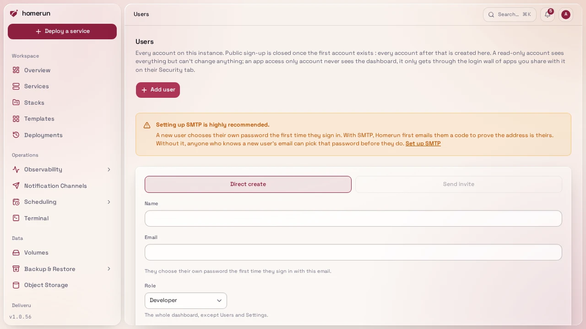
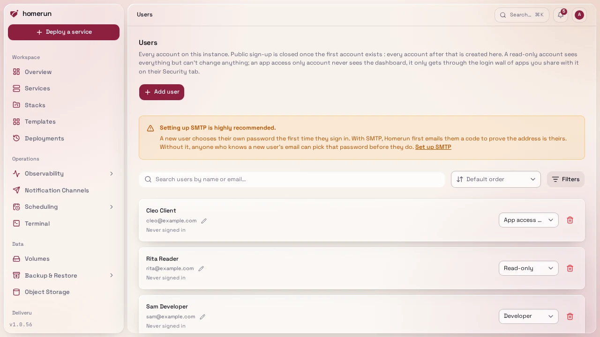

# Users and roles

Homerun has five roles, **admin**, **developer**, **read-only**, **app access
only** and **custom**. Every dashboard account sees the same pool of resources,
and what an account may do with it is decided by its **permissions**. Services,
stacks, volumes, backups, backup destinations, build cache registries, remote
hosts, cron jobs, status pages, custom templates and the job queue are shared,
whoever created them. Each one still records who created it. What stays personal
is your sessions, API keys, preferences, git provider connections, terminal
sessions, bell feed and notification channels. Every account gets a copy of each
bell notification, and every account's own notification channels hear about
every event. Homerun has no teams and no per-stack access control: permissions
are per area of the dashboard, not per resource.

## Permissions

Homerun has 18 permission areas: **Services**, **Stacks**, **Templates**, **Cron
jobs**, **Redirects**, **Status pages**, **Volumes & backups**, **Object
storage**, **Docker Registry**, **Build cache**, **Git providers**,
**Notification channels**, **DNS**, **Remote hosts**, **System**,
**Infrastructure as code**, **Users & authentication** and **Settings**. An
account holds each one at **Read** or **Write** (write includes read), or not at
all.

Every dashboard page and every REST API route belongs to one area. Reading it
needs read access, changing anything needs write access, and an account without
the permission gets a `403`: a dashboard page shows a 403 error page, the
sidebar and global search leave out what you can't open, and the API, remote
commands and form actions refuse the request on the server, so hiding a link is
never the only protection. Your profile, the overview, CLI login, the API docs
and the MCP endpoint are open to every signed-in account (MCP tools call the
REST API, so each call is checked against the account's permissions).

**System** is the host-level area: the host terminal, system logs, Docker
cleanup, host command cron jobs and the service options that give a container
access to the host (privileged mode, device mappings, added capabilities and env
files), including templates and compose imports that set them. Treat it as root
on the box. **Write access to Users & authentication** can grant any permission,
its holder's own included, so it's an admin in all but name.

The roles are presets of those permissions:

| Role            | What it holds                                                                                                                                                              |
| --------------- | -------------------------------------------------------------------------------------------------------------------------------------------------------------------------- |
| Admin           | Write on every area                                                                                                                                                        |
| Developer       | Write on Services, Stacks, Templates, Cron jobs, Redirects, Status pages, Volumes & backups, Build cache and Notification channels; read on Git providers and Remote hosts |
| Read-only       | Read on the developer's areas                                                                                                                                              |
| App access only | Nothing: no dashboard at all, see below                                                                                                                                    |
| Custom          | Exactly the areas you pick for that user, each at Read or Write                                                                                                            |

A **read-only** account sees what a developer sees but can't change anything:
every form, button and API call that writes is refused with a message naming the
area ("You don't have permission to change Services."), enforced on the server
for form actions, remote commands and the REST API alike. What they can still do
is look after their own account: sign out, change their password, manage
passkeys and two-factor, set preferences, clear their notification bell, create
API keys (limited to what they can read) and log in the CLI.

**Custom** is for everyone in between. On **Users**, switch the account's role
to **Custom**, then click the **Permissions** button on its row and pick an
access level per area. Switching to Custom starts from the permissions of the
role the account had, so you only adjust the difference. Invites and direct
creation only offer the preset roles; change a new account to Custom afterwards.

**App access only** accounts never see the dashboard. They exist so you can let
someone (a client, a friend, the family) through the [login wall](login-wall.md)
of the apps you choose without giving them anything else. They sign in on the
normal sign-in page, with a password, passkey, OAuth provider or emailed code
like anyone else, and are sent straight back to the app they were trying to
open. Opening the dashboard URL directly lands them on a small **Your apps**
page instead: the apps whose login wall currently lets them through (pull
request previews show their PR number and title), their passkeys and two-factor
setup, **Set a password** for an account that signs in by emailed code only, and
a Sign out button. Every dashboard page, form, remote call and REST API route
refuses them on the server, not just in the menu, and so does the MCP endpoint.
They can't create or use API keys or log in the CLI, and an API key they held
under an earlier role stops working. They can still use **Sign in with Homerun**
apps (see [Sign in with Homerun](sign-in-with-homerun.md)), since that's a login
for an app, not for Homerun. To share an app with one, tick them under **Users**
on the app's Security tab, or add `app-user` to its **Groups / roles** to let
every app-access account in.

**The first account created on a fresh instance becomes admin automatically.**
After that, there's no public sign-up, every other account is created by an
admin from `/users`:

- **Direct-create**, name/email/role only, no password to set or hand over. The
  new account signs in itself the first time: it enters its email on the sign-in
  page and, since it doesn't have a password yet, is walked through choosing one
  there (a 6-digit emailed code first if SMTP is configured, so the person
  really owns that address; straight to picking a password if it isn't). Works
  with no email setup either way. With emailed codes switched on, that step also
  offers **Skip the password, sign in with emailed codes**.

  

- **Email invite**, only shown once SMTP is configured (see
  [Configuration](configuration.md)); sends a link to
  `/auth/accept-invite/<token>`, valid for 7 days. The pending list on `/users`
  shows only invites that can still be accepted; an expired one drops off, and
  inviting the same address again replaces it. While emailed codes or links are
  switched on (Authentication → Sign-in), the invite page lets the person choose
  between **Set a password** and **Emailed codes**: the second creates the
  account with no password at all, and they sign in each time with a code sent
  to their address. They can add a password later, after confirming an emailed
  code (Profile → Security, or **Your apps** for app-access-only accounts).

**Inviting a client to review a pull request preview.** Invite them with the
**App access only** role, and on the preview's parent service's Security tab
allow **Emailed code** and tick them under **Users** (previews copy their
parent's login wall). They accept the invite with **Emailed codes**, open the
preview link, enter their email, paste the code, and land on the preview; no
password is ever created.

Without SMTP configured, `/users` shows a warning: anyone who knows a
direct-created account's email can beat its real owner to the sign-in page and
choose that account's password themselves, since there's no code step proving
who's asking. Set up SMTP (see [Configuration](configuration.md)) before
direct-creating an account if that's a real risk on your instance, or use email
invites instead, which already require it.

Someone with write access to Users & authentication (an admin, by default) can
change a user's role, permissions or email, or remove them, from `/users`. An
email changed there takes effect immediately and is marked verified, no
confirmation link and no SMTP needed, which is the way to change a verified
address on an instance without email set up. Two guards apply: you can't remove
yourself, and you can't demote/remove the last remaining admin. Removing a user
hands everything they created over to the admin who removed them: their services
keep running. A git service they created builds with its new owner's git
provider connection from then on, so reconnect the provider under your profile
if its builds or webhooks start failing. `/users` has a search box (name/email)
and a Role filter once you have more than a couple of accounts, plus a pager
once you have more than a page's worth, searched/paginated server-side.

## Onboarding

The forced first-run wizard (see
[Getting started](getting-started.md#first-boot)) is a property of the
_instance_, not the account, once the bootstrap admin finishes it, later
developer accounts never see it. If an admin invites someone before finishing
onboarding themselves, that person sees a holding message instead of the wizard
(they don't get instance-wide config controls).
