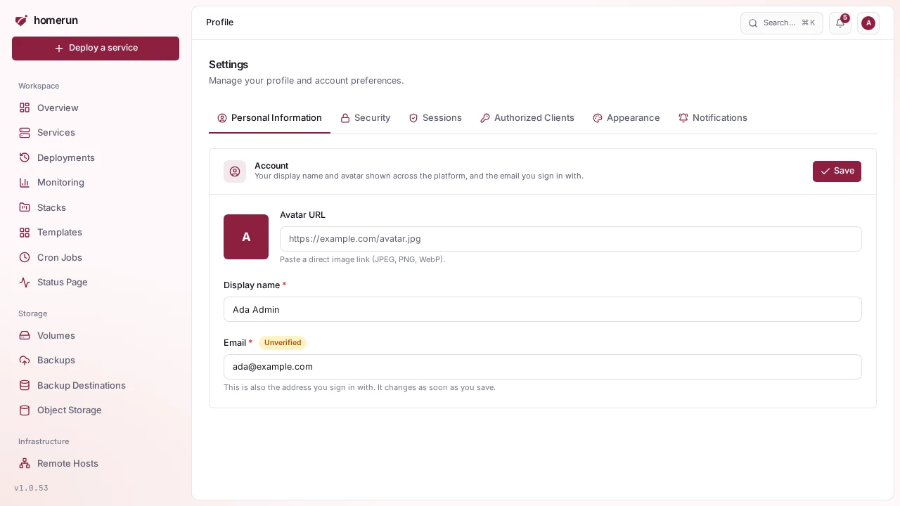
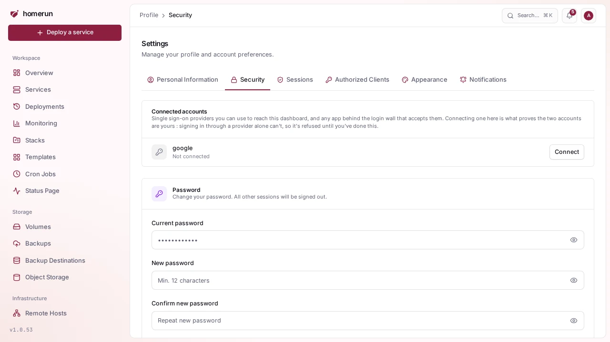
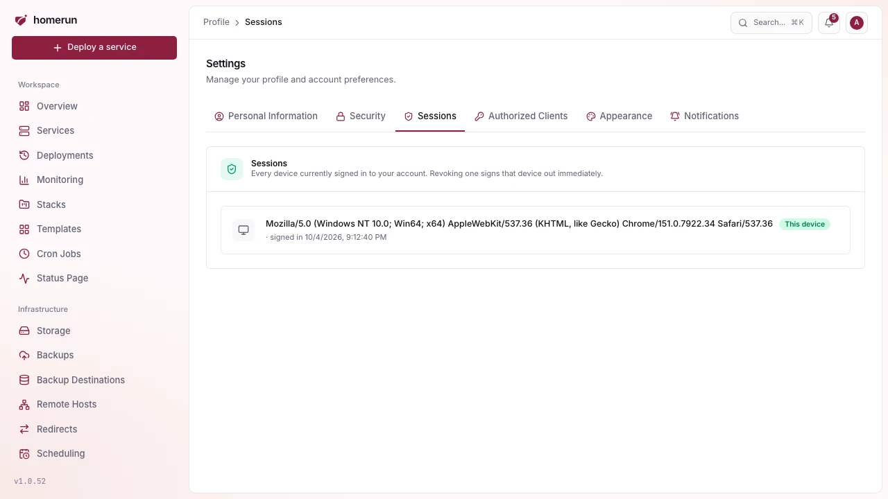
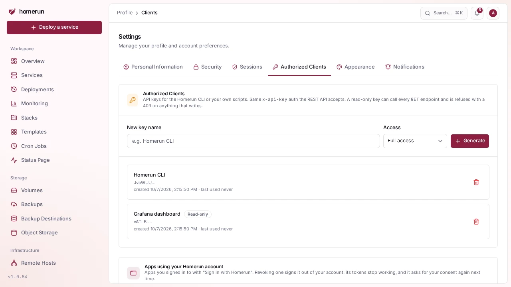
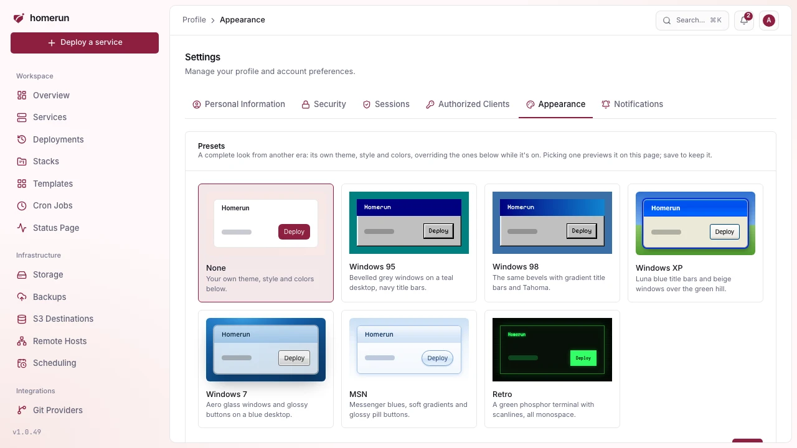

# Your profile

The profile pages (reached from the avatar menu, not the sidebar) are per
account:

- **Personal Information**, your name and email. Changing an unverified email
  takes effect immediately; a verified one needs confirming from a link sent to
  the address you're leaving, so it stays locked until SMTP is configured or an
  admin changes it for you from `/users` (see
  [Known, real limitations](faq-and-limitations.md#known-real-limitations-not-hypothetical)).

  

- **Security**, change your password, connect or disconnect OAuth providers (see
  [Connecting a provider to an existing account](authentication-providers.md#connecting-a-provider-to-an-existing-account)),
  set up [two-factor authentication and passkeys](two-factor-and-passkeys.md),
  and delete your account. Deleting it hands everything you created over to
  another admin (or, failing that, the oldest other account), so nothing stops
  running. Only when yours is the last account are its containers removed with
  it.

  

- **Sessions**, every browser currently signed in as you, with the device and
  when it was last seen. Revoke any of them, useful after signing in somewhere
  you don't control.

  

- **API Keys**, see [below](#api-keys), including the ones the
  [CLI](api-and-cli.md#logging-in) created for itself through its device-code
  login.
- **Authorized Clients**, every app you signed in to with "Sign in with Homerun"
  ([OIDC provider](authentication-providers.md)). Revoking one deletes its
  tokens, so it's signed out of your account right away and asks for your
  consent again next time.
- **Appearance**, see [below](#appearance).
- **Notifications**, which events each of your notification channels receives,
  see [Notifications](notifications.md).

## API keys

**Profile → API Keys** lists your keys; **New API key** opens the page that
creates one, to use the [REST API or CLI](api-and-cli.md) without a browser
session, sent as `x-api-key` or `Authorization: Bearer <key>` on any `/api/v1/*`
request. When you create one, pick:

- **Permissions**, per area (see
  [Users and roles](users-and-roles.md#permissions)): none, **Read** or
  **Write**. The **Read everything** and **Clear** shortcuts fill or empty the
  whole list. A key can never hold more than the account that creates it, and at
  request time it's always limited to what its owner holds _right now_, so
  demoting an account also demotes every key it owns. A key that needs one thing
  (deploy one service, read the status of everything) should get only that area.
- **Allow all permissions**, flagged dangerous: the key follows everything its
  owner can do, including permissions granted to the owner later. Only for a key
  you'd trust as much as your own login.
- **Expires**: 7 days, 30 days, **90 days** (the default, recommended), 1 year
  or **Never**, which shows a warning because a leaked key then works until you
  revoke it. An expired key is refused and shows an **Expired** badge in the
  list.

A request that needs a permission the key doesn't have gets a `403` naming the
area. `homerun login` keys are created with all permissions and no expiry, and
keys created before permissions existed were migrated: a read-only key became
read on every area, a full-access key became "all permissions".

`homerun login` creates one for you through a device-code flow rather than
making you copy-paste, and it shows up in this list like any other. Keys for
Terraform, OpenTofu or Pulumi can also be created and revoked from an IaC
project's **Credentials** tab (see
[Infrastructure as code](infrastructure-as-code.md#credentials)).

## Appearance

A per-account "Appearance" tab on your profile page controls:

- **Interface**: **Simple**, **Advanced** or **Follow the instance default**
  (the default), see [Simple and advanced modes](ui-modes.md). The profile menu
  switches between simple and advanced in one click too.
- **Presets**: a complete look from another era, with its own theme, style and
  colors: **Windows 95**, **Windows 98**, **Windows XP**, **Windows 7**, **MSN**
  or **Retro** (a green phosphor terminal), each with its own fonts: a pixel
  sans for Windows 95/98, Tahoma for XP, Segoe UI for Windows 7 and MSN (with
  bundled substitutes where they aren't installed) and VT323 for Retro. While
  one is on it overrides the theme, style and colors below, which stay saved for
  when you pick **None** again. Each has a preview, and picking one previews it
  on the page until you save.
- **Theme**: light, dark, or match system (the default). Changes apply instantly
  and are saved to your account, so the choice follows you to a new browser or
  device, not just the one you set it on.
- **Style**: how panels, cards and buttons are drawn: **Glass** (the default,
  Apple-style liquid glass: blurred panels with a lit edge, all tinted by your
  accent), **Sleek** (flat and crisp: one solid content panel, hairline borders,
  a faint wash of your accent), **Neumorphism** (one flat tone, panels raised by
  soft light and shade), **Boxy** (square corners, solid panels, hard offset
  shadows), **Claymorphism** (puffy, round panels), **Skeuomorphism** (textured,
  bevelled panels and buttons) or **Material You** (Google's style: tonal
  surfaces derived from your accent, pill buttons, filled fields, Roboto Flex).
  Each choice shows a small preview and previews on the page itself when picked;
  **Save** keeps it. Works with either theme and any palette.
- **Colors**: a palette (Bordeaux, the default, Ocean, Forest, Sunset, Grape,
  Rose or Graphite) sets the accent for buttons, links and tab icons plus the
  hues charts, category tiles and the background use, all chosen to go together.
  **Custom** sets the accent alone from any color.
- **Tabs**: where a page's tabs go: **Above the page** (the default) or **In a
  column beside the page**, a second sidebar next to the main one that lists the
  section's tabs while you're in it. On a narrow screen they stay above the
  page.
- **Lists**: how many rows every paginated list (services, stacks, templates,
  deployments, backups and the rest) shows per page: 25, 50 (the default), 100
  or 200. A `?perPage=` in the page's URL still wins for that one view.

These are personal preferences, not instance-wide settings, each account picks
its own independently of `/settings`.

## Git provider accounts

Separate from signing in to Homerun: connecting a GitHub, GitLab, Gitea or
Bitbucket account on the **Git Providers** page lets a git-based service pick
its repository and branch instead of pasting a URL, reach private ones without a
token in the clone URL, and deploy on every push through a webhook Homerun adds
for you. An admin registers the OAuth app once for the instance; each person
connects their own account to it. See
[Connecting a git provider](git-providers.md).
